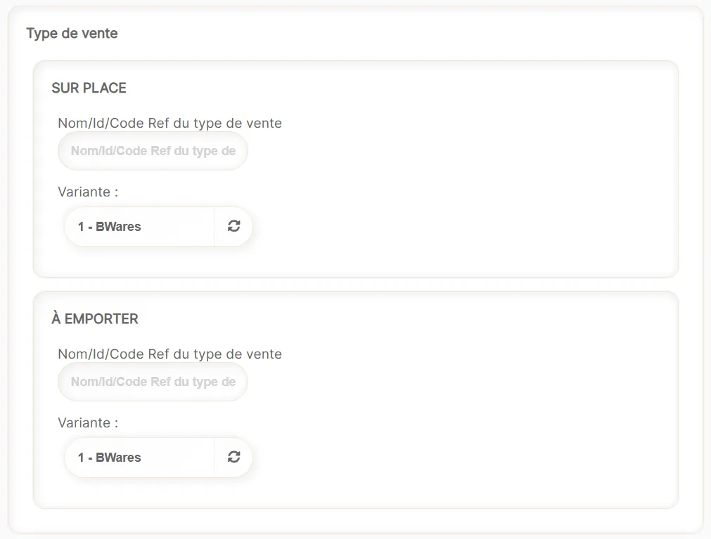
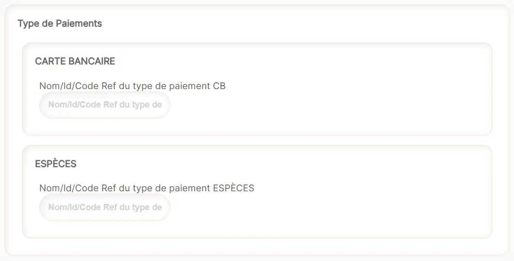
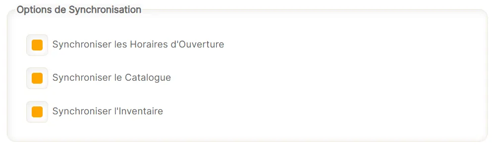

Une fois la connexion entre BWares et HubRise établie, vous pouvez lancer la configuration depuis le back-office de BWares. Pour cela :
1. Depuis le back-office de BWares, cliquez sur **INTÉGRATIONS**.
2. Sur la page **GESTION DES INTÉGRATIONS**, trouvez HubRise et cliquez sur le bouton correspondant.
3. La configuration s’effectue depuis la page **MODIFICATION D'UNE CONFIGURATION EXISTANTE**.

## Type de vente

Il est possible de définir deux types de service pour HubRise : **SUR PLACE** ou **À EMPORTER**. 

Pour chaque type de service, vous pouvez indiquer un code ref correspondant. Ce code ref peut être nécessaire au bon fonctionnement de votre logiciel de caisse également connecté via HubRise.
Une variante de catalogue peut également être associée à chaque type de vente. Cette association est facultative. Il est possible qu'il n'y ait pas de variante de catalogue disponible sur HubRise. 

## Type de paiement

Il est possible de définir deux types de paiement pour HubRise : **CARTE BANCAIRE** ou **ESPÈCES**. 

Pour chaque type de paiement, vous pouvez indiquer un code ref correspondant. Ce code ref peut être nécessaire au bon fonctionnement de votre logiciel de caisse également connecté via HubRise.

## Options de Synchronisation

Vous pouvez choisir de synchroniser les horaires d’ouverture, le catalogue produits et les inventaires de BWares avec ceux disponibles sur HubRise. Il vous suffit de cocher les cases correspondantes :

- **Synchroniser les horaires d’ouverture** : Cela impacte les horaires de l’établissement. En dehors de ces horaires, les bornes seront bloquées.
- **Synchroniser le catalogue** : Cela impacte la carte présentée au client. Les produits et la mise en page seront mis à jour.
- **Synchroniser l’inventaire** : Permet de mettre à jour les quantités disponibles pour chaque produit.

---

**REMARQUE IMPORTANTE :** Une synchronisation automatique est déclenchée dès qu’une modification est détectée sur HubRise.

---

## Mapping et synchronisation de données

Pour plus d’informations sur le fonctionnement de l’intégration et les données échangées lors de la synchronisation, vous pouvez consulter la documentation disponible sur le site Internet de BWares, section [Intégration HubRise](https://bwares.notion.site/HubRise-23e20882788c8014a9adf1dad49ce6e7). 