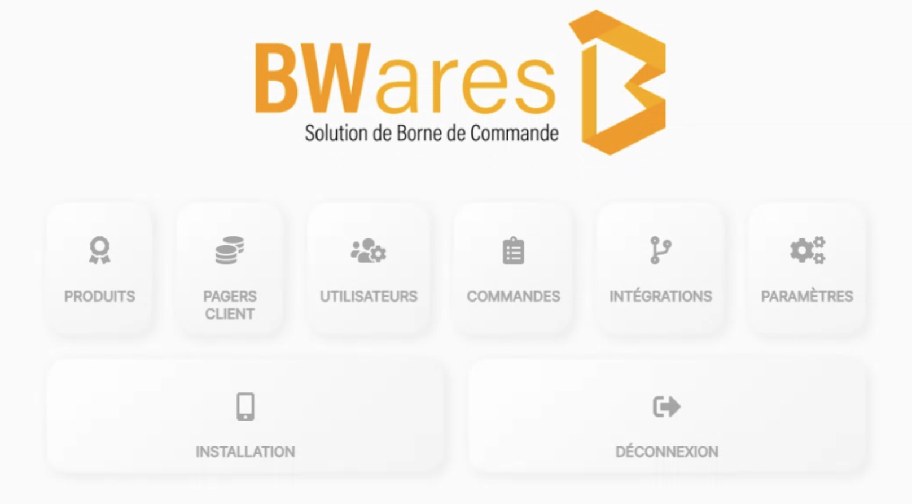
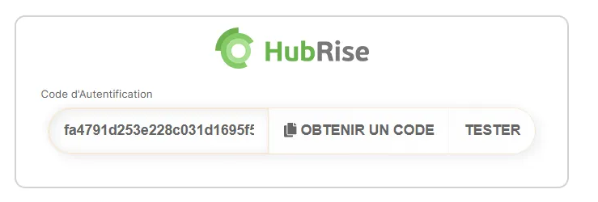
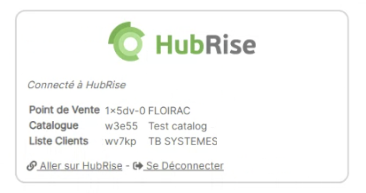
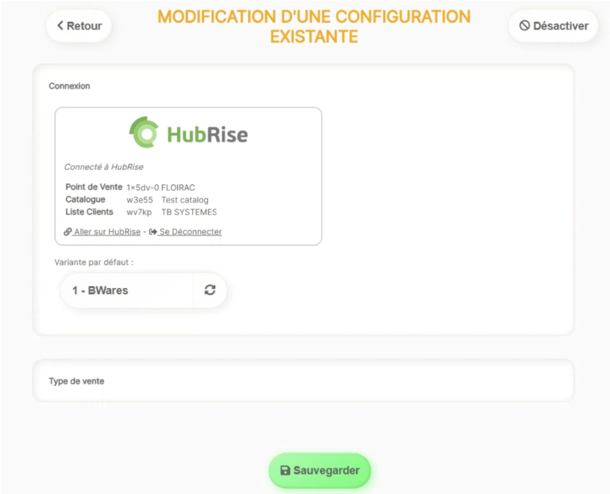

---

**REMARQUE IMPORTANTE :** Si vous ne possédez pas encore de compte HubRise, rendez-vous sur la [page d'inscription à HubRise](https://manager.hubrise.com/signup). L'inscription ne prend qu'une minute !

---

## Connecter BWares

Pour connecter BWares à HubRise, suivez ces étapes :

1. Depuis le back-office de BWares, cliquez sur **INTÉGRATIONS**.
   
2. Page **GESTION DES INTÉGRATIONS**, trouvez HubRise et cliquez sur le bouton **+**.
3. Section **Renseigner un nom pour la nouvelle configuration**, donnez un nom à la configuration, **HubRise** par exemple, puis validez en cliquant sur **OK**.
4. Cliquez sur **OBTENIR UN CODE**. Vous êtes redirigé vers l'interface HubRise. S'il s'agit de votre première connexion, créez un compte HubRise. Pour plus d'informations, consultez notre [Guide de démarrage](/docs/get-started).
5. Si votre compte possède plusieurs points de vente, développez **Choisissez le point de vente**, sélectionnez le point de vente à connecter, puis cliquez sur **Autoriser**. Si le point de vente sélectionné possède plusieurs listes de clients ou catalogues, cliquez sur **Suivant** pour afficher les listes déroulantes correspondantes, puis sélectionnez les options souhaitées.
6. Cliquez sur **Autoriser**.
7. On vous propose alors de copier un code. Cliquez sur **Copier**.
8. Retournez dans le back-office BWares pour coller ce code dans le champ **Code d’authentification**.
   
9. Cliquez sur **TESTER** pour finaliser l’installation. La connexion à HubRise est désormais établie.
   

Si ces étapes vous semblent trop complexes, vous pouvez également faire appel à l’équipe support de BWares pour connecter BWares à HubRise. Pour cela :

1. Donnez accès à BWares à votre compte HubRise. Pour plus d'informations, voir [Donner accès au support de BWares](#give-access).
2. Contactez l'équipe de support de BWares qui se chargera d'établir la connexion à HubRise. Pour plus d'informations, voir [Contacter le support de BWares](#contact).

## Donner accès au support de BWares {#give-access}

Pour connecter BWares et faciliter le traitement de vos demandes de support, vous devez accorder à BWares l'accès à votre compte HubRise.

Pour donner accès à BWares, procédez comme suit :

1. Depuis le back-office de HubRise, sélectionnez **CONFIGURATION** dans le menu de gauche.
1. Dans la section **Permissions**, ajoutez `sav@tbsys.fr`.
1. Cliquez sur **Ajouter l'utilisateur**.
1. Dans le menu déroulant de choix d'un rôle prédéfini, sélectionnez **Partenaire Technique**.
1. Cliquez sur **Définir les permissions**.

L'ajout d'un utilisateur est le moyen recommandé de donner accès à un tiers à votre compte HubRise ou au point de vente. Le partage de mot de passe est déconseillé pour des raisons de sécurité. Pour plus d'informations sur les permissions, voir notre aide en ligne, page [Permissions](/docs/permissions).

## Contacter le support de BWares {#contact}

Pour demander la connexion de votre borne de commande, contactez le support de BWares par e-mail sur sav@tbsys.fr. Vous pouvez inclure support@hubrise.com en copie pour un suivi coordonné entre nos deux équipes.

Indiquez dans votre demande le nom de votre compte HubRise, son identifiant HubRise et le point de vente à connecter. Pour plus d'informations, voir [Nom et identifiant du point de vente](/docs/locations#location-name-and-id).

## Déconnecter BWares

Si vous souhaitez seulement stopper temporairement la réception des commandes de votre borne sur HubRise, vous pouvez bloquer la connexion entre BWares et HubRise. Pour plus d'informations, voir [Bloquer ou déconnecter une application](/docs/connections#block-or-disconnect).

Pour déconnecter BWares de HubRise de manière définitive, procédez comme suit :

1. Depuis la page d'accueil du back-office de BWares, cliquez sur **INTÉGRATIONS**.
2. Ouvrir la connexion HubRise.
3. Cliquer sur **Se Déconnecter**.
4. BWares est déconnecté de HubRise.

Pour déconnecter BWares de HubRise, vous pouvez également contacter le support de BWares.
