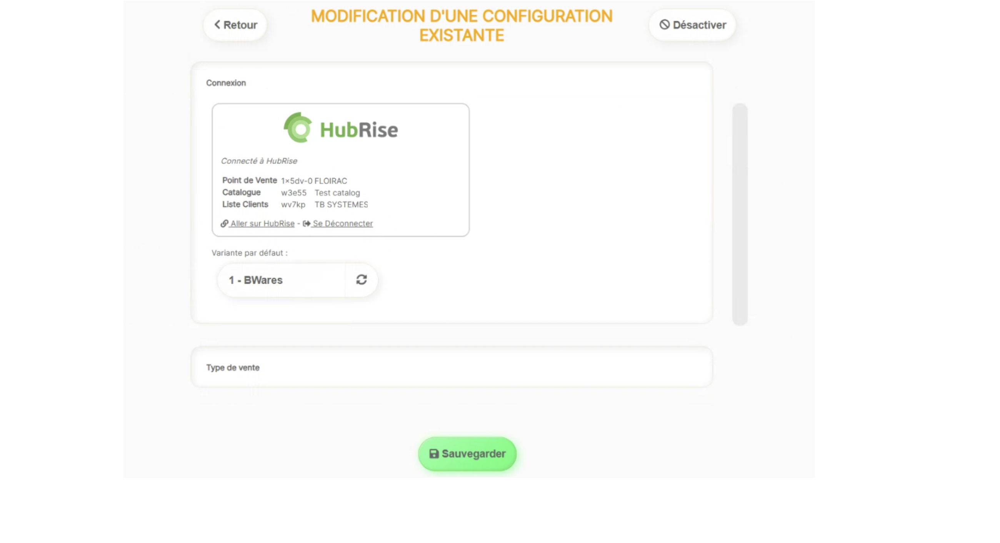

---

**REMARQUE IMPORTANTE :** Si vous ne possédez pas encore de compte HubRise, rendez-vous sur la [page d'inscription à HubRise](https://manager.hubrise.com/signup). L'inscription ne prend qu'une minute !

---

## Connecter BWares

Il est possible de connecter votre borne de commande à HubRise de manière autonome depuis le back office de BWares, section **INTÉGRATIONS**. Nous recommandons cependant de faire appel à l'équipe de support de BWares.

Pour connecter BWares à HubRise, procédez comme suit :

1. Accordez à BWares l'accès à votre compte HubRise. Pour plus d'informations, voir [Donner accès au support de BWares](#give-access).
2. Contactez l'équipe de support de BWares qui se chargera d'établir la connexion à HubRise. Pour plus d'informations, voir [Contacter le support de BWares](#contact).

## Donner accès au support de BWares {#give-access}

Pour connecter BWares et faciliter le traitement de vos demandes de support, vous devez accorder à votre fournisseur BWares l'accès à votre compte HubRise.

Pour donner accès à BWares, procédez comme suit :

1. Depuis le back-office de HubRise, sélectionnez **CONFIGURATION** dans le menu de gauche.
1. Dans la section **Permissions**, ajoutez `sav@tbsys.fr`.
1. Cliquez sur **Ajouter l'utilisateur**.
1. Dans le menu déroulant de choix d'un rôle prédéfini, sélectionnez **Partenaire Technique**.
1. Cliquez sur **Définir les permissions**.

L'ajout d'un utilisateur est le moyen recommandé de donner accès à un tiers à votre compte HubRise ou au point de vente. Le partage de mot de passe est déconseillé pour des raisons de sécurité. Pour plus d'informations sur les permissions, voir notre aide en ligne, page [Permissions](/docs/permissions).

## Contacter le support de BWares {#contact}

Pour demander la connexion de votre borne de commande, contactez le support de BWares par e-mail sur sav@tbsys.fr. Vous pouvez inclure support@hubrise.com en copie pour un suivi coordonné entre nos deux équipes.

Indiquez dans votre demande le nom de votre compte HubRise, son identifiant HubRise et le point de vente à connecter. Pour plus d'informations, voir [Nom et identifiant du point de vente](/docs/locations#location-name-and-id).

## Déconnecter BWares

Si vous souhaitez seulement stopper temporairement la réception des commandes de votre borne sur HubRise, vous pouvez bloquer la connexion entre BWares et HubRise. Pour plus d'informations, voir [Bloquer ou déconnecter une application](/docs/connections#block-or-disconnect).

Pour déconnecter BWares de HubRise de manière définitive, procédez comme suit :

1. Depuis la page d'accueil du back-office de BWares, cliquez sur **INTÉGRATIONS**.
2. Ouvrir la connexion HubRise. 
3. Cliquer sur **Se Déconnecter**.
4. BWares est déconnecté de HubRise.

Pour déconnecter BWares de HubRise, vous pouvez également contacter le support de BWares.
