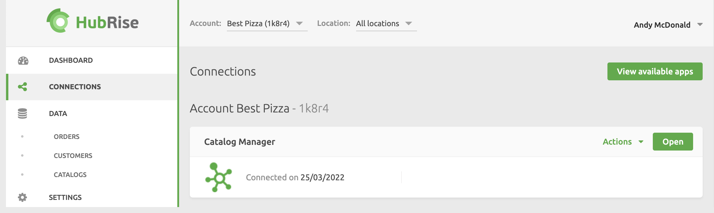

---

**IMPORTANT NOTE:** If you do not have a HubRise account yet, register on our [Signup Page](https://manager.hubrise.com/signup). It only takes a minute!

---

To use Catalog Manager, you first need to connect it to your HubRise account. To connect Catalog Manager, follow these steps:

1. Log in to your [HubRise back office](https://manager.hubrise.com).
1. Select **CONNECTIONS**, then **View available apps**.
1. Click **Catalog Manager** from the list of apps.
1. Select **Connect**.
1. Click **Allow** to grant Catalog Manager permission to access your HubRise account.
1. You have now added Catalog Manager to your HubRise Account.

For more information on how to connect, block and disconnect an app on HubRise, refer to our online Help page [Apps and Connections](/docs/connections).
