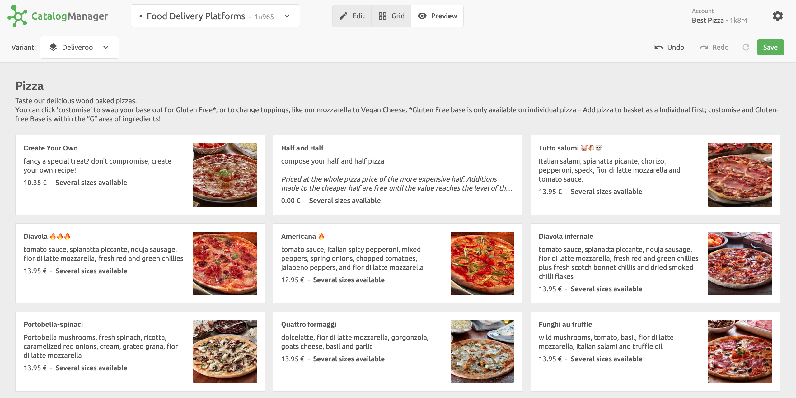

Before saving your catalog and uploading it to HubRise, you can preview it from the **Preview** view. The **Preview** mode shows your catalog in a similar way to most food delivery platforms, so you can test how your customers will interact with your catalog.

While you review your catalog, pay attention to images, product names, options, and prices, as these play an important role in the customers' experience.

If you created [catalog variants](/apps/catalog-manager/variants), think of checking your catalog for each variant in use. You can do this by selecting variants in the **Variants** dropdown list, which is available in the top left corner of the page.

When you are ready to push your updated catalog to HubRise, click **Save**.

