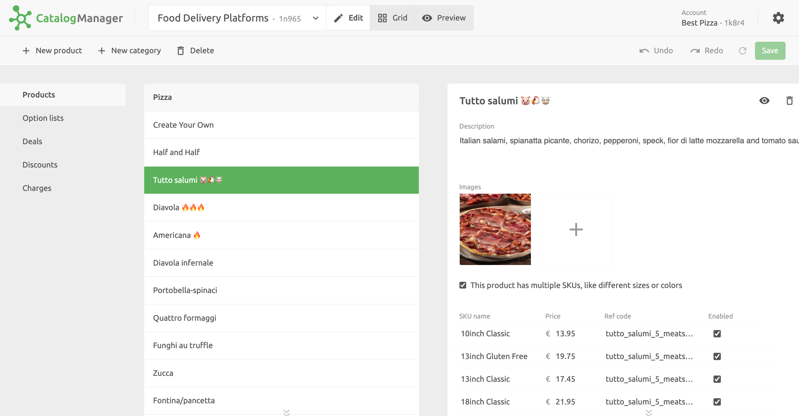
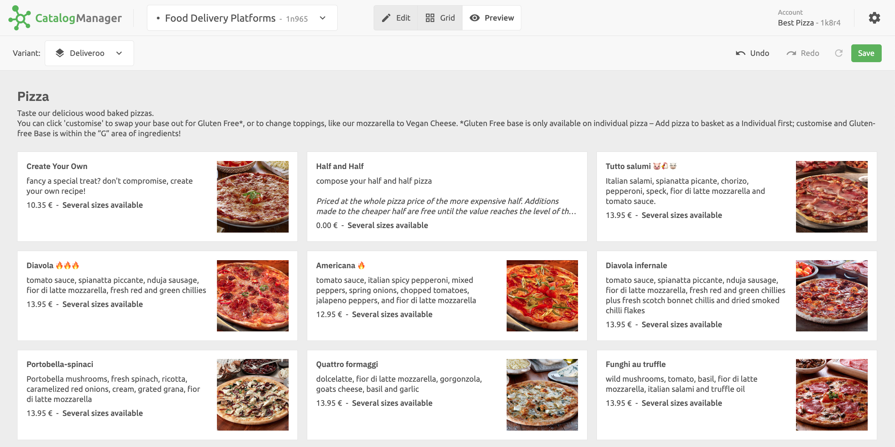

## Catalogs Page

When you open Catalog Manager from the **CONNECTIONS** page in the HubRise back office, you see the list of catalogs available in your account on the **Catalogs** page.
To edit an existing catalog, click **Open** next to the catalog name.

On the **Catalogs** page, you can also perform the following actions:

- Create a new catalog
- Rename a catalog
- Duplicate a catalog
- Delete a catalog

For more information, see [Catalogs](/apps/catalog-manager/catalogs).

## Catalog Editing Flow

Editing a catalog is a complex task that often requires multiple iterations.
Catalog Manager is designed to simplify this process with its modular user interface.

When you edit a catalog, you typically perform the following steps:

1. You edit the basic information about your products, including options, prices, images and ref codes.
1. You create variants of your catalog to support price differences or product availability per sales channel, if needed.
1. You preview your catalog online appearance to verify that your product offerings are presented as expected.

The **Edit**, **Grid**, and **Preview** views in Catalog Manager let you perform these actions in an iterative way.

## The Edit View

To create and edit your catalog items, use the **Edit** view in Catalog Manager.
From the **Edit** view, you can create and manage products, options, deals, discounts, and charges.

## The Grid View

After you create your products, options, and deals, you can review them from the **Grid** view, where they are presented in a tabular form for easier comparison.
The **Grid** view also lets you create and manage variants of your catalog, to control availability and prices for different sales channels. For more information, see [Catalog Variants](/apps/catalog-manager/variants).

## The Preview View

When your catalog is complete, you can preview it from the **Preview** view.
The **Preview** view lets you navigate your product in a similar way to food delivery platforms.
This is a simple but powerful way to check for mistakes in your products and verify that everything is correct before submitting your catalog to your connected apps.

## Manage Settings

To manage the settings of Catalog Manager, click the cog icon at the top right corner.

From the **Settings** panel, you can edit the interface language.
