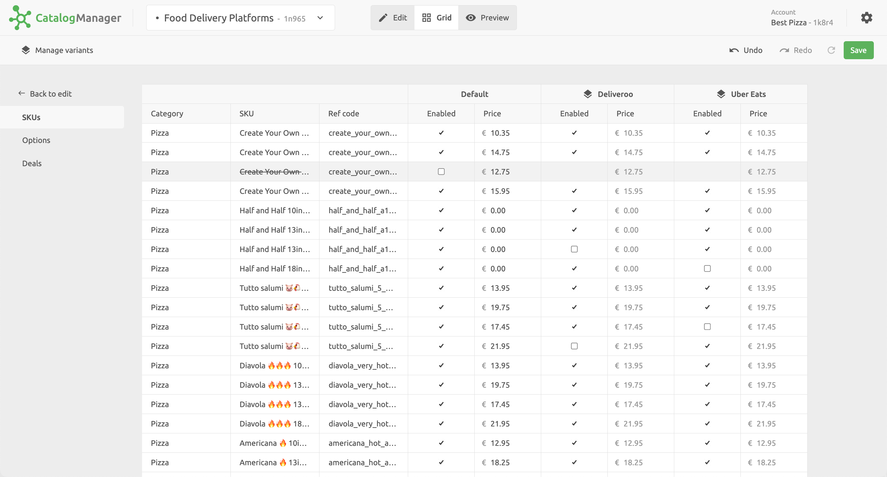

Catalog variants let you manage different prices and availability with a single catalog. For example, you can create and manage one catalog on HubRise for Deliveroo, Uber Eats, your branded online ordering website, and your self ordering kiosk, even though prices may differ on each of these channels.

Some common setups include:

- Variants per delivery channels: `Deliveroo`, `Uber Eats`, `Shopify`, etc.
- Variants per locations: `London`, `Paris`, etc.
- Variants per groups of locations: `Downtown`, `Northern areas`, etc.
- Variants per sales channels: `Online`, `In-store`, etc.
- Variants per service type: `Delivery`, `Eat-In`, `Takeaway`.

You can also use a combination of the above examples: `Deliveroo`, `Uber Eats Paris`, `Uber Eats northern areas`, etc.

For more information about variants, see the <Link href="/blog/catalog-variants">Catalog Variants blog post</Link>.

## Create Variants

To create a variant, follow these steps:

1. In Catalog Manager, select **Grid**.
1. In the **Grid** view, click the **Manage variants** link in the top left hand corner of the page.
1. In the dialog panel that appears, select **New variant**, then choose a name for your variant.
1. To finish, click **Close**.

Repeat the process for any additional variant that you want to create.

## Manage Variants Availability and Prices

For each of the variants you created, you can edit prices for each product, option, and deal in your catalog. You can also edit availability by enabling or disabling them.

When you create a new product, option, or deal in your catalog, it duplicates for all variants. You can then adjust its price, or disable it.

Disabling an item in the **Default** column will automatically disable it for all variants.

When you finish editing your variants, to update the catalog in HubRise remember to click **Save**.

## Use Variants in Apps

To use the availability and prices of a variant in an app connected to the catalog, you need to select the variant in the app settings.

For instance, to use the `Deliveroo Paris` variant, open the Deliveroo Bridge for the Paris location, and select the **Configuration** tab. In the **Catalog variant to push** section, select **Deliveroo Paris** and click **Save**.

For other apps, refer to the app documentation on HubRise for specific instructions.

---

**IMPORTANT NOTE:** All HubRise Bridges support catalog variants, but not all third-party integrated applications do. Check your app documentation on HubRise to find out if this feature is supported.

---
