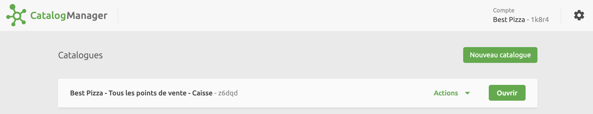
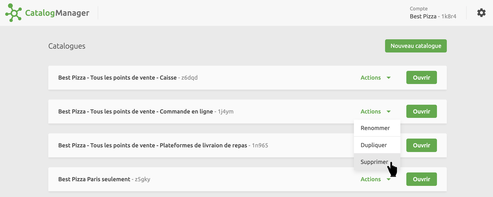
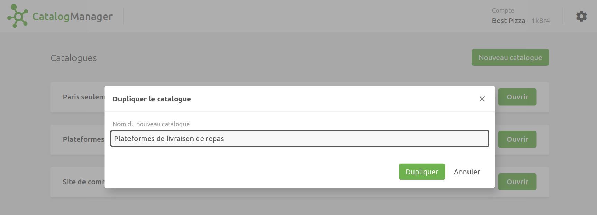

Un **Catalogue** est un conteneur pour vos produits et les informations qui leur sont associées. Les catalogues sont stockés dans HubRise et gérés à l'aide de Catalog Manager.

Les catalogues peuvent être créés globalement pour tous les points de vente, ou pour un point de vente spécifique. Pour plus d'informations, consultez les pages d'aide HubRise [Comptes](/docs/account) et [Points de vente](/docs/locations).

Par exemple, dans un point de vente, vous pouvez créer un catalogue pour importer des produits depuis votre logiciel de caisse et les synchroniser avec votre solution de commande en ligne. Dans un autre, vous pouvez créer un catalogue qui est géré manuellement et utilisé uniquement pour alimenter votre menu en ligne. Vous pouvez également avoir plusieurs catalogues dans le même point de vente.

## Ouvrir la page Catalogues

La page **Catalogues** est la page par défaut de Catalog Manager. Elle s'ouvre lorsque vous
[lancez Catalog Manager](/apps/catalog-manager/launch-catalog-manager). Vous pouvez à tout moment revenir à cette page en cliquant sur le logo en haut à gauche de l'écran.

## Créer un catalogue

Pour créer un catalogue dans Catalog Manager, ouvrez la page **Catalogues**, cliquez sur **Nouveau catalogue** et saisissez un nom. Après avoir créé le catalogue, vous pouvez ajouter des catégories, des produits, des options, des promotions, des remises et des frais directement dans Catalog Manager.

Il est important de noter que la création d'un catalogue dans Catalog Manager l'établit automatiquement au niveau du compte, et non au niveau du point de vente. Pour créer un catalogue spécifiquement au niveau du point de vente, vous devez le faire à partir de la page **CONFIGURATION** de votre back-office HubRise. Pour plus d'informations, consultez la page d'aide HubRise [Ajouter un catalogue](/docs/catalog#add).

## Actions sur les catalogues

Vous pouvez **Renommer**, **Dupliquer** ou **Supprimer** les catalogues existants à l'aide du menu déroulant **Actions** du Catalog Manager disponible sur la page **Catalogues** du Catalog Manager.

## Dupliquer un catalogue {#duplicate}

Dupliquer un catalogue peut être utile si vous souhaitez créer un catalogue basé sur un catalogue existant ou faire une sauvegarde de votre catalogue.

Pour dupliquer un catalogue, suivez ces étapes :

1. Dans Catalog Manager, accédez à la page **Catalogues**.
2. Trouvez le catalogue que vous souhaitez dupliquer, développez la liste **Actions**, puis sélectionnez **Dupliquer**.
3. Indiquez un nom pour le nouveau catalogue, puis cliquez sur **Dupliquer**.

Utilisez des noms clairement identifiables pour vos catalogues. Par exemple, si vous créez un catalogue pour Uber Eats, vous pouvez l'appeler **Uber Eats**. Si vous créez un catalogue de sauvegarde, incluez **Sauvegarde** ou **Ne pas modifier !** dans le nom, afin d'éviter qu'il ne soit modifié.
