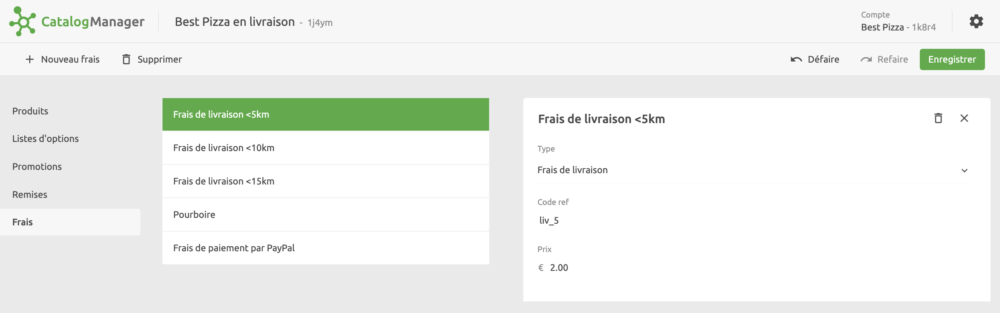

Les frais sont des forfaits que vous pouvez appliquer à un achat global, par exemple des frais de livraison, des pourboires ou d'autres coûts.

## Quelles applications prennent en charge les frais ?

La plupart des applications ne prennent pas en charge les frais, car elles les gèrent généralement directement dans leur back-office. Pour vérifier si une application prend en charge les frais, consultez sa documentation sur le site internet de HubRise.

***

**REMARQUE IMPORTANTE :** Les frais ne sont pas exportés vers les plateformes de livraison de repas. Ils sont gérés directement dans le back-office de la plateforme.

***

## Créer des frais

Pour créer des frais, cliquez sur **Frais** > **Nouveaux frais** et saisissez un nom. Une fois les frais créés, vous pouvez compléter les informations qui s'y rapportent.
