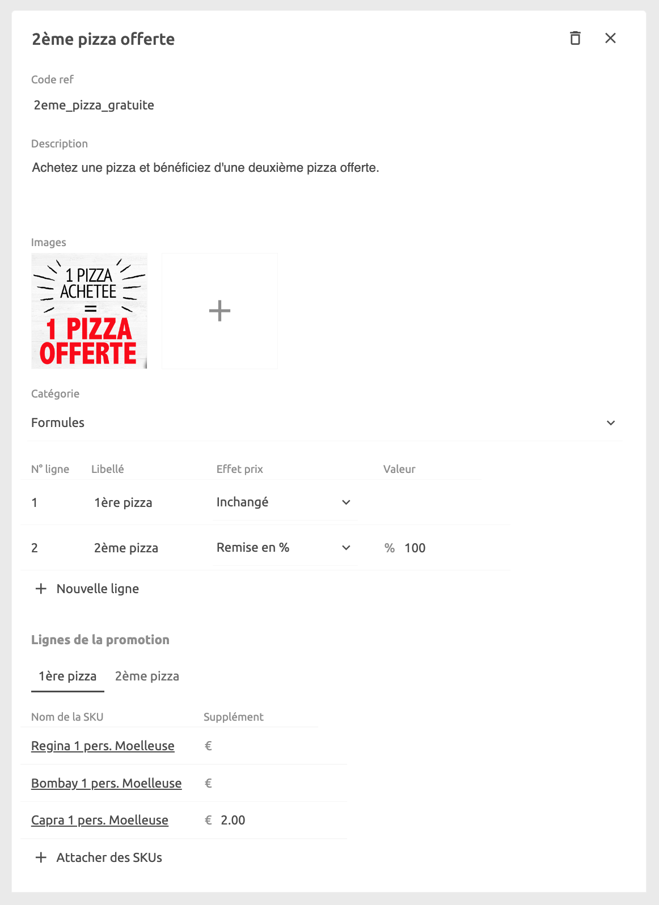

Les promotions sont des offres spéciales que vous pouvez configurer pour votre menu. Il y a plusieurs façons de les configurer afin de répondre à vos besoins spécifiques. Vous pouvez ainsi proposer des remises en pourcentage ou en absolu, et limiter la promotion à certains produits. Un exemple classique est la promotion `Buy One Get One FREE`.

## Créer des promotions

Pour créer une promotion, cliquez sur **Promotions** > **Nouvelle promotion** et saisissez un nom. Une fois la promotion créée, vous pouvez compléter les informations qui s'y rapportent et l'associer à un ou plusieurs produits.

1. Saisissez un **Code ref** en tapant directement dans la zone de texte correspondante.
2. Saisissez une **Description** en tapant directement dans la zone de texte correspondante.
3. Ajoutez une ou plusieurs **Images** de la promotion en cliquant sur l'icône **+**.
4. Sélectionnez une **Catégorie** à laquelle cette promotion appartient et sous laquelle elle sera affichée en ligne.
5. Indiquez les lignes de la promotion. Ces lignes spécifient des groupes de produits parmi lesquels les clients peuvent choisir, ainsi que la règle de tarification appliquée au groupe, par exemple **Prix fixe**, **Remise en %**, **Remise en prix** et prix **Inchangé**.
6. Pour chaque ligne de promotion, sélectionnez les produits que vous souhaitez inclure en cliquant sur **Attacher des SKUs**. Pour chaque article, vous pouvez inclure un prix supplémentaire dans la colonne **Supplément**, qui sera ajouté au prix déterminé par la règle de tarification de l'article.

## Exemples de promotions

### Buy One Get One Free

Pour configurer une promotion `Buy One Get One FREE`, créez une ligne pour représenter la partie `Buy One` de la promotion. Sélectionnez **Inchangé** pour la définir à son prix normal. Ajoutez ensuite une deuxième ligne pour représenter la partie `Get One FREE` de la promotion. Saisissez un effet prix **Remise en pourcentage** de `100%` pour cette ligne. Pour chaque ligne, choisissez les produits autorisés en sélectionnant **Attacher des SKUs** dans la section **Lignes de la promotion**.

### Prix fixe

Pour configurer un `Three-course meal for £20` (Trois plats pour 20 £), vous avez besoin de trois lignes, par exemple une pour l'`Appetiser` (entrée), une pour le `Main dish` (plat principal) et une pour le `Dessert`.

La première est définie à un **Prix fixe** de `£20`, les deux autres à `£0`. Les articles disponibles pour chacune des lignes peuvent être sélectionnés dans la section **Lignes de la promotion** grâce à la fonction **Attacher des SKUs**.
