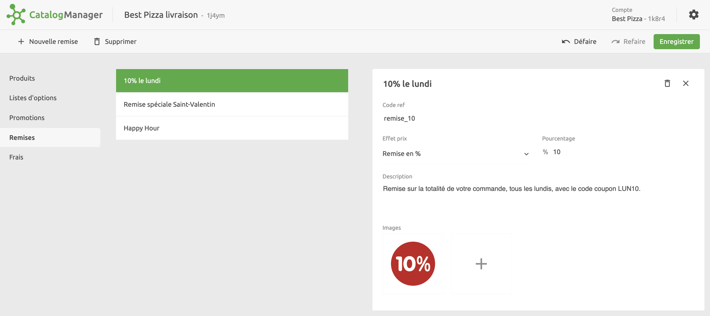

Les remises sont des montants ou des pourcentages de réduction qui s'appliquent à la totalité de la commande, par opposition à un article spécifique.

## Quelles applications prennent en charge les remises ?

Contrairement aux promotions, les remises sont généralement spécifiques à chaque application et ne sont pas toujours prises en charge. Pour vérifier si une application prend en charge les remises, consultez sa documentation sur le site internet de HubRise.

***

**REMARQUE IMPORTANTE :** Les remises ne sont pas exportées vers les plateformes de livraison de repas. Elles sont gérées directement dans le back-office de la plateforme.

***

## Créer des remises

Pour créer une remise dans Catalog Manager, cliquez sur **Remises** > **Nouvelle remise** et saisissez un nom.
Une fois la remise créée, vous pouvez compléter les informations qui s'y rapportent.
