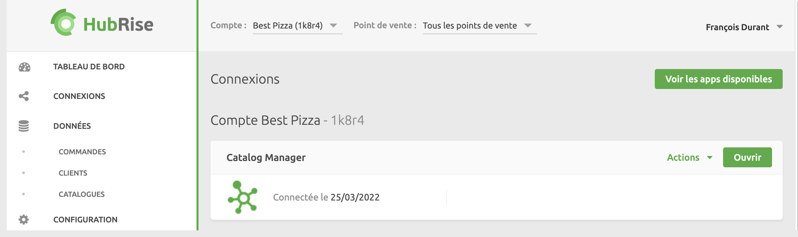

Pour ouvrir Catalog Manager, suivez ces étapes :

1. Connectez-vous à [HubRise](https://manager.hubrise.com).
2. Sélectionnez **CONNEXIONS**.
3. Cliquez sur **Ouvrir** à côté de l'application Catalog Manager. Catalog Manager s'ouvre dans un nouvel onglet du navigateur.

Pour fermer Catalog Manager, il suffit de fermer l'onglet du navigateur. Cela met fin à votre session.

Catalog Manager a été testé et est compatible avec tous les principaux navigateurs. Pour une expérience optimale, nous vous recommandons cependant d'utiliser Google Chrome sur un ordinateur de bureau ou un ordinateur portable.
