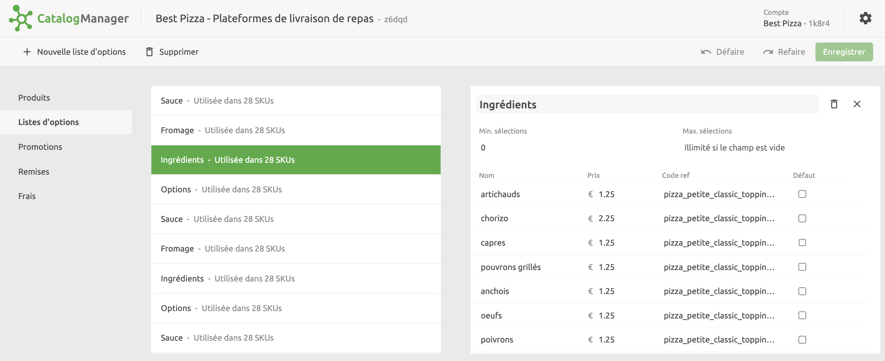
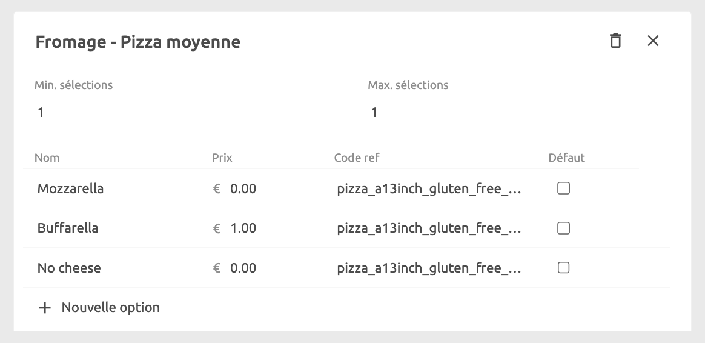
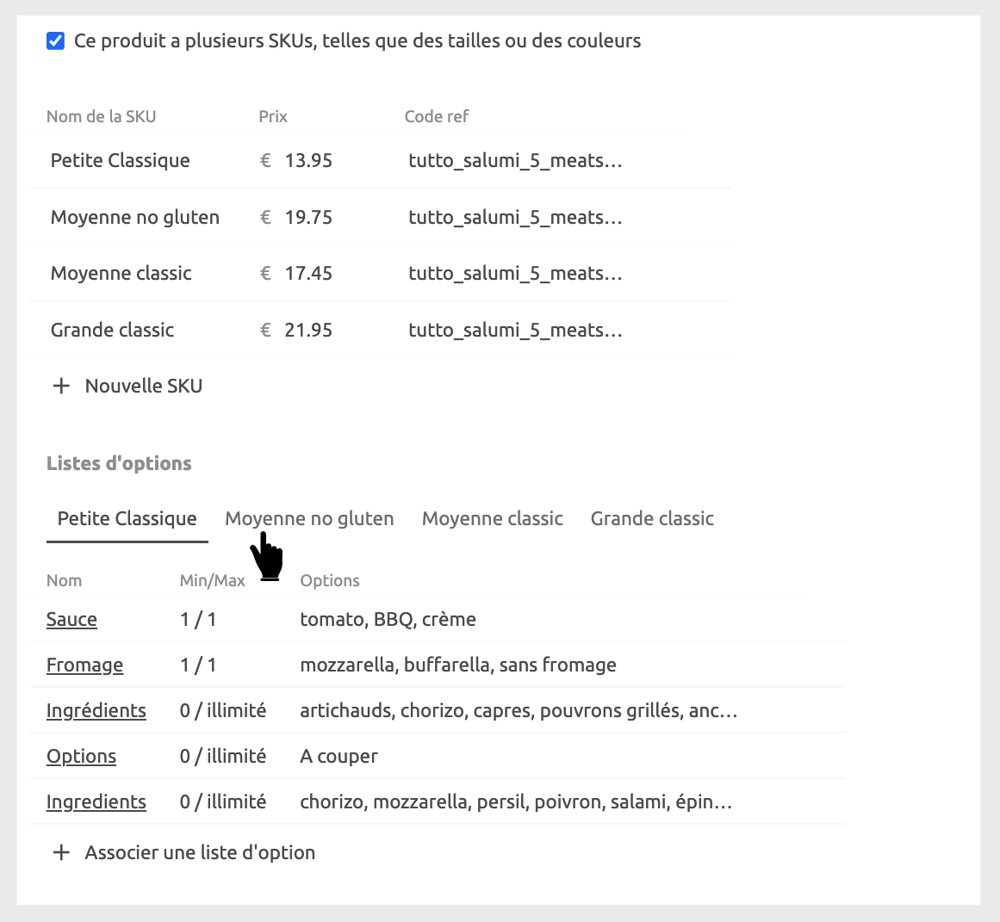
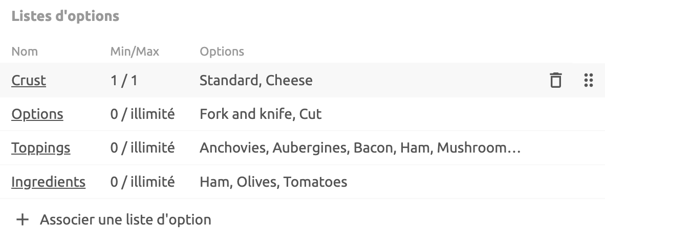

Les options sont des éléments supplémentaires que les clients peuvent ajouter à un produit lors de la commande.

Lorsque vous créez un produit, vous pouvez l'associer à une ou plusieurs listes d'options. Les listes d'options doivent être créées avant de pouvoir être associées aux produits. Les listes d'options peuvent varier d'une variante de produit à une autre. Par exemple, les garnitures supplémentaires sur une pizza de taille moyenne peuvent être moins chères que celles proposées sur une grande pizza.

Sur la page des listes d'options, vous pouvez voir le nombre de SKU ou de produits dans lesquels une liste est utilisée. Vous pouvez ainsi savoir quelles options sont utilisées dans quels produits.

## Créer des listes d'options

Des listes d'options peuvent être ajoutées au produit de base s'il n'y a pas de variante de produit, ou à chaque variante de produit le cas échéant.

Les listes d'options doivent être créées avant de pouvoir être associées aux produits. Pour créer une liste d'options, cliquez sur **Listes d'options** dans le menu de gauche, puis sélectionnez **Nouvelle liste d'options**. Les informations suivantes sont requises :

- Nom
- Nombre minimum d'options qu'un client peut sélectionner. La valeur par défaut est `0`.
- Nombre maximum d'options qu'un client peut sélectionner. Par défaut, cette valeur est vide, ce qui indique qu'il n'y a pas de limite.
- Pour chaque option, saisissez un **Nom**, un **Prix**, un **Code ref**, et cochez la case **Défaut** si l'option doit être sélectionnée par défaut.

N'oubliez pas que les listes d'options sont associées à des produits spécifiques ou à des variations de produits. Si les options diffèrent d'une variation de produit à l'autre, il est conseillé de nommer vos listes d'options de manière à vous permettre de les identifier facilement. Par exemple, pour les articles pizza, vous pouvez avoir trois options de fromage. Si les options et les prix connexes sont identiques, quelle que soit la pizza ou la taille de la pizza à laquelle ils sont associés, la liste peut être appelée `Fromage - Pizza `. S'ils sont différents, vous pouvez appeler une liste `Fromage - Pizza Moyenne` et l'autre `Fromage - Pizza Grande` pour retrouver plus facilement la liste que vous souhaitez associer.

Après avoir créé une ou plusieurs listes d'options, vous pouvez les associer à vos produits :

1. Sélectionnez l'onglet de la variation de produit à laquelle vous souhaitez ajouter des options, par exemple `Petite classique`.
2. Cliquez sur **Associer une liste d'options**, puis sélectionnez la liste d'options à attacher dans la liste déroulante.
3. Répétez pour chaque autre variation de produit.

## Supprimer une liste d'options

Pour supprimer une liste d'options, sélectionnez-la dans la liste et cliquez sur l'icône de suppression située dans le volet de détails. Si vous supprimez une liste d'options, elle est automatiquement supprimée de tous les produits qui y sont associés.

## Réorganiser les listes d'options

Pour modifier l'ordre dans lequel les listes d'options sont affichées dans le catalogue, faites-les glisser en utilisant les poignées situées à droite de chaque liste d'options. Cela permet de les organiser, sans pour autant modifier la façon dont elles sont affichées dans un produit.

Pour modifier l'ordre dans lequel les listes d'options sont affichées dans un produit, accédez à **Produits**, sélectionnez le produit dans lequel vous souhaitez effectuer une réorganisation, puis faites glisser la liste d'options en utilisant la poignée située à droite. L'ordre dans lequel les listes d'options sont affichées dans un produit est géré dans les applications vers lesquelles vous envoyez le catalogue.

