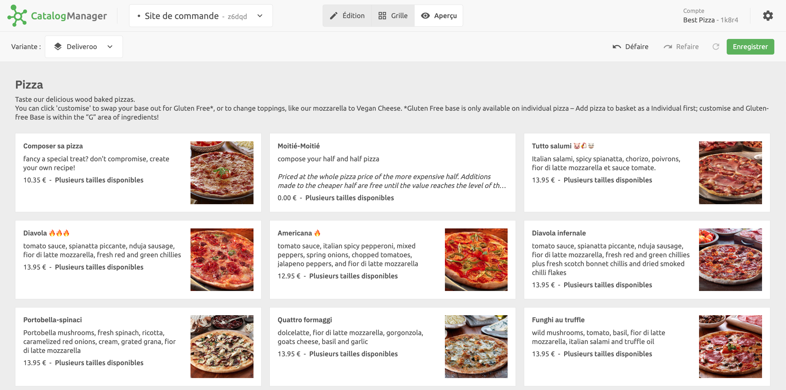

Avant d'enregistrer votre catalogue et de le charger dans HubRise, vous pouvez le prévisualiser dans la vue **Aperçu**. Cette vue affiche votre catalogue comme il apparaîtrait dans la plupart des plateformes de livraison de repas. Vous pouvez ainsi tester comment vos clients peuvent interagir avec.

Soyez particulièrement attentif aux images, aux noms de produits, aux options et aux prix, car ils jouent un rôle important dans l'expérience des clients.

Lorsque vous êtes prêt à envoyer votre catalogue mis à jour vers HubRise, cliquez sur **Enregistrer**.

