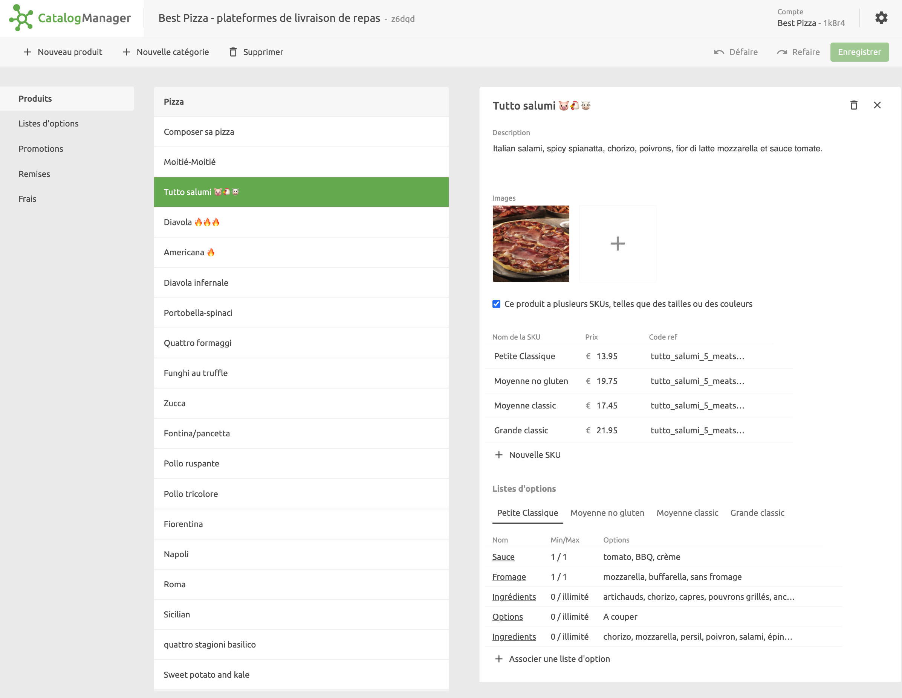
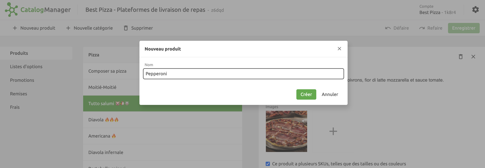
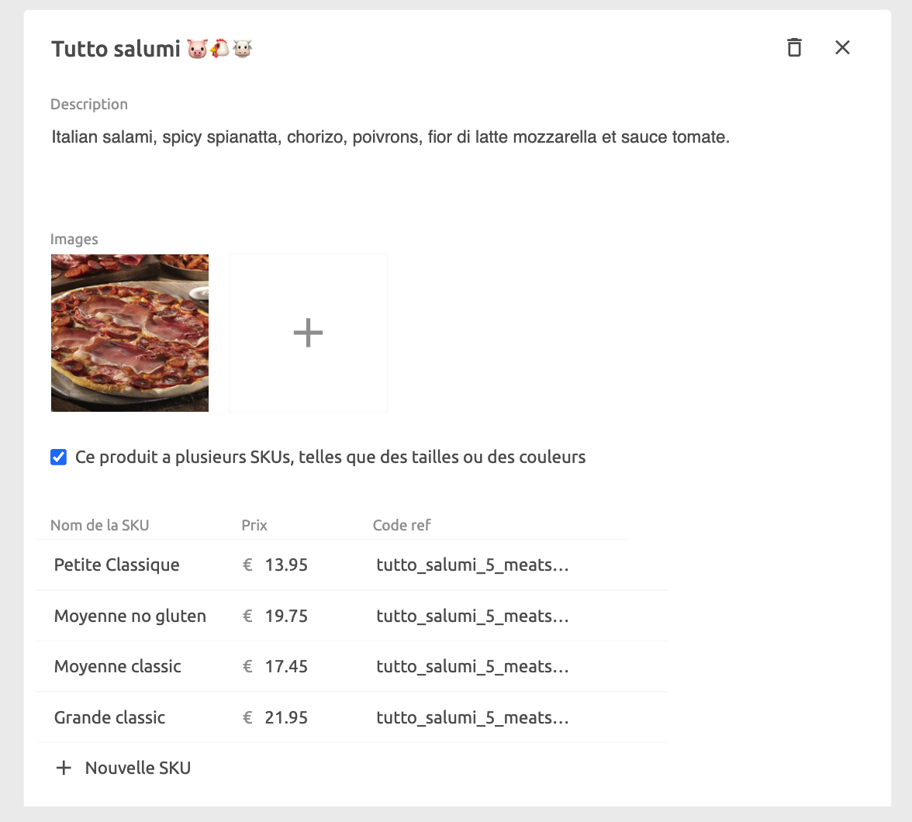
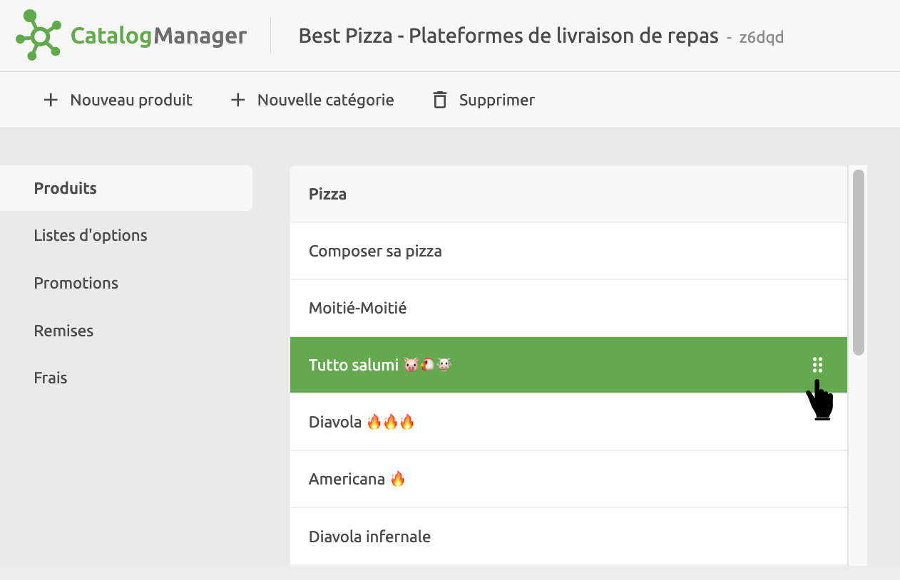

Lorsque vous ouvrez un catalogue, la page **Produits** s'affiche dans la vue **Édition**.
Elle liste tous vos produits regroupés par catégories. Pour ajouter une catégorie, cliquez sur **Nouvelle catégorie** et saisissez un nom.

Dans le volet de détails de chaque produit, vous pouvez afficher et modifier les informations suivantes :

- Nom du produit
- Description
- Images
- Variantes, appelées **SKU**
- Listes d'options

Les variantes sont généralement utilisées pour proposer différentes versions du produit de base, par exemple des tailles ou des couleurs. Les options permettent de spécifier des éléments supplémentaires optionnels, tels que des suppléments.

***

**REMARQUE IMPORTANTE :** Chaque variante dispose d'un code ref et d'un prix, qui doivent être saisis si vous connectez un logiciel de caisse. Si un produit n'a pas de variante, le code ref du produit de base doit être saisi.

***

## Créer un produit {#create}

Pour créer un produit, sélectionnez la catégorie ou le produit situés juste au-dessus de l'endroit où vous voulez placer votre produit. Cliquez sur **Nouveau produit** et entrez un nom qui le décrit.

Une fois le produit créé, vous pouvez y ajouter des détails et l'associer à des articles optionnels et des promotions.

## Ajouter ou modifier les détails d'un produit

- Dans le champ **Description**, saisissez la description du produit.
- Ajoutez une ou plusieurs photos du produit en cliquant sur l'icône **+**. Pour les plateformes de commande et de livraison de repas, nous recommandons que les images soient au format jpg ou png, de 1200x800 pixels ou plus, avec un ratio de 16:9.
- Si le produit comporte des variantes parmi lesquelles le client doit choisir, cochez la case **plusieurs SKUs**.
  Ensuite, pour chaque variante, saisissez le **Nom de la SKU**, le **Prix** et le **Code ref**.
  S'il n'y a pas de variante, veuillez saisir le prix et le code ref du produit.
- Vous pouvez inclure plus de variantes en sélectionnant **+ Nouvelle SKU**.

## Supprimer un produit

Pour supprimer un produit, sélectionnez-le dans la liste des produits et cliquez sur l'icône de suppression située dans le volet de détails du produit.

## Réorganiser les produits

Vous pouvez réorganiser l'ordre des articles en utilisant la poignée située à droite de chaque produit.

L'ordre dans lequel les produits sont affichés dans Catalog Manager est géré dans les applications vers lesquelles vous envoyez le catalogue.
