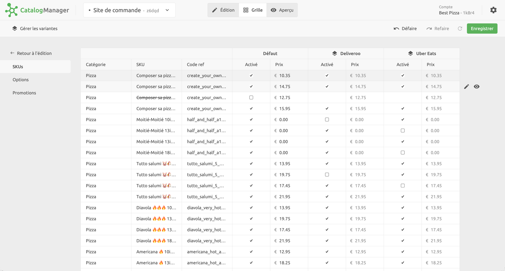

## Page Catalogues

Lorsque vous ouvrez Catalog Manager depuis la page **CONNEXIONS** dans le back-office HubRise, la page **Catalogues** affiche la liste des catalogues disponibles dans votre compte.
Pour modifier un catalogue existant, cliquez sur **Ouvrir** à côté du nom du catalogue.

Sur la page **Catalogues**, vous pouvez également effectuer les actions suivantes :

- Créer un nouveau catalogue
- Renommer un catalogue
- Dupliquer un catalogue
- Supprimer un catalogue

Pour plus d'informations, voir [Catalogues](/apps/catalog-manager/catalogs).

## Étapes de modification du catalogue

La modification d'un catalogue est une tâche complexe qui se fait souvent en plusieurs fois.
Catalog Manager est conçu pour simplifier le processus grâce à son interface utilisateur modulaire.

Lorsque vous modifiez un catalogue, vous effectuez généralement les étapes suivantes :

1. Vous modifiez les informations de base sur vos produits, comme les options, les prix, les images et les codes ref.
2. Vous devrez peut-être créer plusieurs variantes de votre catalogue pour prendre en charge les différences de prix ou la disponibilité des produits par canal de vente.
3. Vous prévisualisez l'apparence en ligne de votre catalogue pour vérifier que votre offre produit est conforme à vos attentes.

Les vues **Édition**, **Grille** et **Aperçu** de Catalog Manager permettent d'effectuer ces actions de manière itérative.

## Vue Édition

Pour créer et modifier les articles de votre catalogue, utilisez la vue **Édition** de Catalog Manager.
Dans cette vue, vous pouvez créer et gérer des produits, des options, des promotions, des remises et des frais.

## Vue Grille

Après avoir créé vos produits, options et promotions, vous pouvez les réviser dans la vue **Grille**, où ils sont présentés sous forme de tableau pour une comparaison plus facile.
Dans cette vue, vous pouvez également créer et gérer des variantes de votre catalogue, afin de contrôler la disponibilité et les prix pour les différents canaux de vente. Pour plus d'informations, voir [Variantes de catalogues](/apps/catalog-manager/variants).

## Vue Aperçu

Lorsque votre catalogue est terminé, vous pouvez le prévisualiser dans la vue **Aperçu**.
Dans cette vue, vous pouvez accéder à votre produit comme si vous naviguiez sur les plateformes de livraison de repas.
C'est un moyen simple mais très efficace de repérer d'éventuelles erreurs dans vos produits et de vérifier que tout est correct avant d'envoyer votre catalogue à vos applications connectées.

## Gérer les paramètres

Pour gérer les paramètres de Catalog Manager, cliquez sur l'icône en forme de roue dentée en haut à droite.

Dans la fenêtre **Paramètres**, vous pouvez modifier la langue de l'interface.
