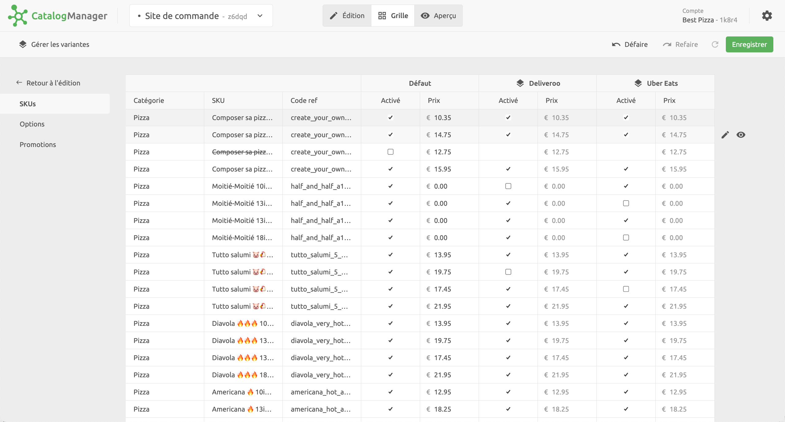

Les variantes de catalogue permettent de gérer différents prix et disponibilités sur plusieurs solutions avec un seul catalogue. Par exemple, vous pouvez créer et gérer un catalogue sur HubRise pour les plateformes de commande et de livraison de repas (Deliveroo et Uber Eats), pour votre propre solution de commande en ligne en marque blanche et votre kiosque de commande sur place, même si les prix différent sur chacun de ces canaux.

Voici quelques configurations courantes :

- Variantes par canaux de livraison : `Deliveroo`, `Uber Eats`, `Shopify`, etc.
- Variantes par point de vente : `Londres`, `Paris`, etc.
- Variantes par groupes de points de vente : `Centre-ville`, `Quartiers Nord`, etc.
- Variantes par type de canal : `En ligne`, `En boutique`, etc.
- Variantes par type de service : `En livraison`, `Sur-place`, etc.

Vous pouvez également utiliser une combinaison des exemples ci-dessus : `Deliveroo`, `Uber Eats Paris`, `Uber Eats quartiers nord villes`, etc.

Pour plus d'informations sur les variantes, voir l'<Link href="/blog/catalog-variants">article de blog Variantes de catalogue</Link>.

## Créer des variantes

Pour créer une variante, suivez ces étapes :

1. Dans Catalog Manager, sélectionnez **Grille**.
2. Dans la vue **Grille**, cliquez sur le lien **Gérer les variantes** dans le coin supérieur gauche de la page.
3. Dans la boîte de dialogue qui s'affiche, sélectionnez **Nouvelle variante**, puis saisissez le nom que vous souhaitez donner à votre variante.
4. Pour terminer, cliquez sur **Enregistrer**.

Répétez le processus pour chaque variante supplémentaire que vous voulez créer.

## Gérer la disponibilité et les prix des variantes

Pour chacune des variantes que vous avez créées, vous pouvez modifier les prix de chaque produit, option et promotion de votre catalogue. Vous pouvez également modifier leur disponibilité en les activant ou en les désactivant.
Lorsque vous créez un nouveau produit, une nouvelle option ou une nouvelle promotion dans votre catalogue, il se duplique pour l'ensemble des variantes. Vous pouvez ensuite ajuster son prix, ou le désactiver.
La désactivation d'un élément dans la colonne **Défaut** le désactive automatiquement pour toutes les variantes.

Lorsque vous avez fini de modifier vos variantes, pour mettre à jour le catalogue dans HubRise, n'oubliez pas de cliquer sur **Enregistrer**.

## Utiliser les variantes dans les applications

Pour utiliser les prix et la disponibilité d'une variante dans une application connectée au catalogue, vous devez sélectionner la variante dans les paramètres de l'application.

Par exemple, pour utiliser la variante `Uber Eats Paris`, ouvrez Deliveroo Bridge et sélectionnez l'onglet **configuration**. Dans la section **Variante de catalogue à envoyer**, sélectionnez **Uber Eats Paris** parmi les menus de livraison et de vente à emporter disponibles. Pour les autres applications, reportez-vous à la documentation de l'application sur HubRise pour obtenir des instructions spécifiques.

***

**REMARQUE IMPORTANTE :** Tous les bridges HubRise prennent en charge les variantes de catalogue, mais toutes les autres applications intégrées ne le font pas. Consultez la documentation de votre application sur HubRise pour savoir si cette fonctionnalité est prise en charge.

***
