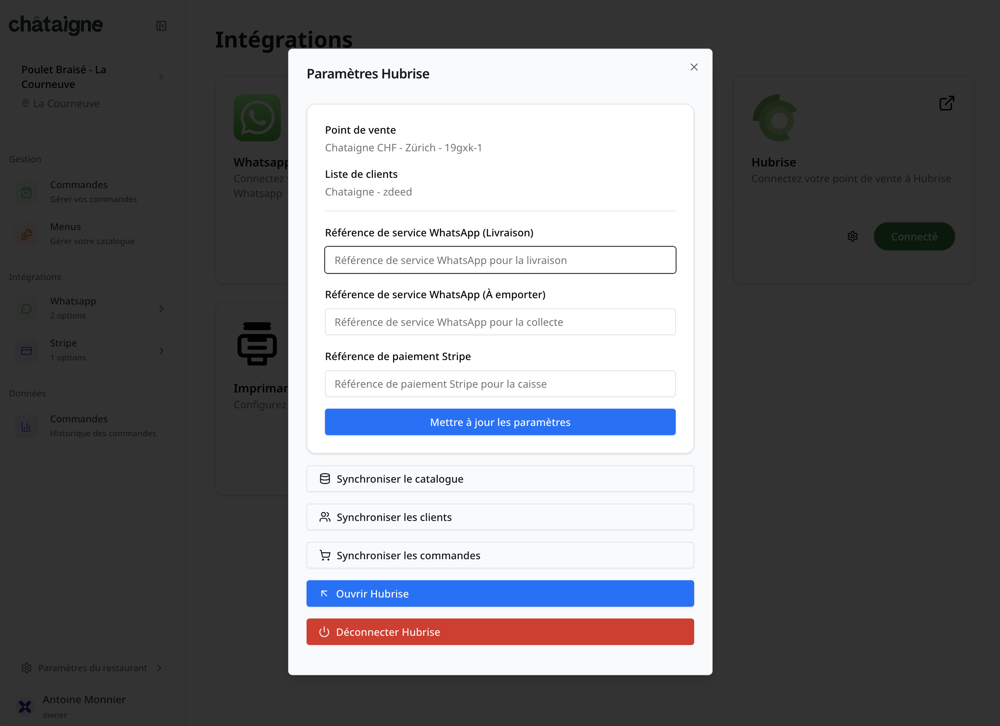

---

**IMPORTANT NOTE:** If you do not have a HubRise account yet, register on our [Signup Page](https://manager.hubrise.com/signup). It only takes a minute!

---

## Connect Châtaigne

To can connect Châtaigne to HubRise, follow these steps :

1. From Châtaigne's back office of, click **Paramètres du Restaurant** (Restaurant Settings) and then **Intégrations** (Integrations).
2. Find HubRise, and click the **Connecter** (Connect) button. You are redirected to the HubRise interface. If this is your first time logging in, create a HubRise account. For more information, check out our [Getting Started Guide](/docs/get-started).
3. If your account has multiple locations, expand the **Choose location** section to select the desired location, and click **Allow**. For locations with multiple customer lists or catalogs, click **Next** to display the corresponding dropdown lists, and select the desired options.
4. Click **Authorise**.
5. You are redirected to the SOLUTION interface, and the connection to HubRise is established.

## Grant Access to Châtaigne Support

To connect Châtaigne and facilitate the handling of your support requests, you need to grant your Châtaigne provider access to your HubRise account.

To grant access to Châtaigne, proceed as follows:

1. From the HubRise back office, select **SETTINGS** in the left-hand menu.
2. In the **Permissions** section, add `contact@chataigne.ai`.
3. Click on **Edit permissions** and select the permissions to grant Châtaigne support for access to your account or location.

Adding a user is the recommended way to grant access to a third party to your HubRise account or location. Sharing passwords is not recommended for security reasons. For more information on permissions, see the [Permissions](/docs/permissions) help page.

## Disconnect Châtaigne

If you need to temporarily stop receiving orders from HubRise, you can block the connection between Châtaigne and HubRise. For more information, see [Block or Disconnect App](/docs/connections#block-or-disconnect).

If you need to stop sending Châtaigne orders to HubRise altogether, it is preferable to disconnect Châtaigne from HubRise via the Châtaigne back office :

1. From Châtaigne's back office of, click **Paramètres du Restaurant** (Restaurant Settings) and then **Intégrations** (Integrations).
2. Find HubRise, and then click the settings button, represented by a gear icon.
3. On a red background, you will find the **Déconnecter HubRise** (Disconnect HubRise) button.

