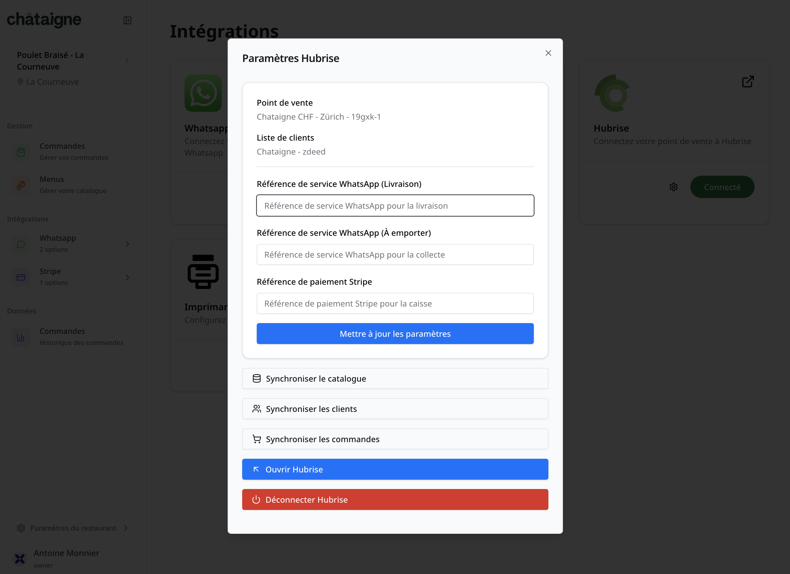

---

**REMARQUE IMPORTANTE :** Si vous ne possédez pas encore de compte HubRise, rendez-vous sur la [page d'inscription à HubRise](https://manager.hubrise.com/signup). L'inscription ne prend qu'une minute !

---

## Connecter Châtaigne

Pour connecter Châtaigne à HubRise, suivez ces étapes :

1. Depuis le back-office de Châtaigne, cliquez sur **Paramètres du Restaurant** puis **Intégrations**.
2. Identifier l'encart HubRise, puis cliquez sur le bouton **Connecter**. Vous êtes redirigé vers l'interface HubRise. S'il s'agit de votre première connexion, créez un compte HubRise. Pour plus d'informations, consultez notre [Guide de démarrage](/docs/get-started).
3. Si votre compte possède plusieurs points de vente, développez **Choisissez le point de vente**, sélectionnez le point de vente à connecter, puis cliquez sur **Autoriser**. Si le point de vente sélectionné possède plusieurs listes de clients ou catalogues, cliquez sur **Suivant** pour afficher les listes déroulantes correspondantes, puis sélectionnez les options souhaitées.
4. Cliquez sur **Autoriser**.
5. Vous êtes redirigé vers l'interface de Châtaigne, et la connexion à HubRise est établie.

## Donner accès au support de Châtaigne

Pour connecter Châtaigne et faciliter le traitement de vos demandes de support, vous devez accorder à votre fournisseur Châtaigne l'accès à votre compte HubRise.

Pour donner accès à Châtaigne, procédez comme suit :

1. Depuis le back-office de HubRise, sélectionnez **CONFIGURATION** dans le menu de gauche.
1. Dans la section **Permissions**, ajoutez `contact@chataigne.ai`.
1. Cliquez sur **Ajouter l'utilisateur**.
1. Dans le menu déroulant de choix d'un rôle prédéfini, sélectionnez **Partenaire Technique**.
1. Cliquez sur **Définir les permissions**.

L'ajout d'un utilisateur est le moyen recommandé de donner accès à un tiers à votre compte HubRise ou au point de vente. Le partage de mot de passe est déconseillé pour des raisons de sécurité. Pour plus d'informations sur les permissions, voir notre aide en ligne, page [Permissions](/docs/permissions).

## Déconnecter Châtaigne

Si vous avez besoin d'arrêter temporairement la réception des commandes envoyées sur HubRise, vous pouvez bloquer la connexion entre Châtaigne et HubRise. Pour plus d'informations, voir [Bloquer ou déconnecter une application](/docs/connections#block-or-disconnect).

Si vous souhaitez arrêter définitivement l'envoi de commandes Châtaigne à HubRise, il est préférable de déconnecter Châtaigne de HubRise via le back-office de Châtaigne :

1. Depuis le back-office de Châtaigne, cliquez sur **Paramètres du Restaurant** puis **Intégrations**.
2. Identifier l'encart HubRise, puis cliquez sur le bouton des paramètres, représenté par une icône d'engrenage.
3. Sur fond rouge, vous trouverez le bouton **Déconnecter HubRise**.
