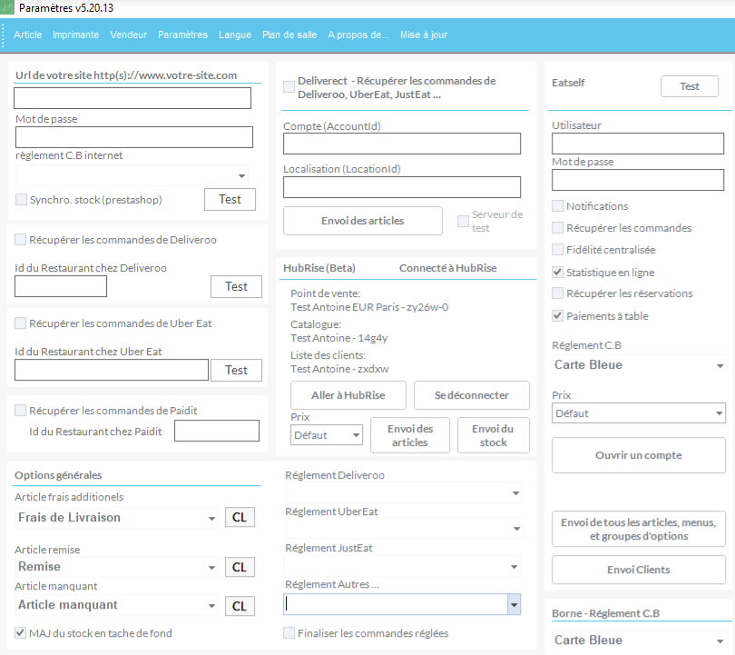

La page de configuration permet de configurer l'intégration HubRise. Elle est accessible dans Clyo Systems, depuis le menu **Paramètres** > **Commandes Web**.

## Options générales

Les options suivantes permettent de configurer le comportement de Clyo en cas de code ref manquant dans une commande HubRise.

### Article frais additionnels

Cette option définit l'article utilisé par défaut pour les frais, tels que les frais de service ou de livraison, lorsque des frais n'ont pas de code ref dans une commande HubRise.

### Article Remise

Cette option définit la remise Clyo utilisée par défaut, lorsqu'une remise n'a pas de code ref dans une commande HubRise.

### Article manquant

Cette option spécifie l'article utilisé par défaut, lorsqu'un article n'a pas de code ref dans une commande HubRise.

## HubRise

La section **HubRise** affiche le statut de votre connexion et permet de paramétrer l'intégration avec HubRise.

### Statut de connexion

Lorsque Clyo Systems est connecté à HubRise, la section affiche les informations suivantes :

- **Point de vente** : Nom et identifiant du point de vente connecté.
- **Catalogue** : Catalogue utilisé pour l'envoi des articles vers HubRise.
- **Liste de Clients** : Non utilisé pour le moment.

### Gestion de la connexion

Le bouton **Aller à HubRise** permet d'ouvrir le back-office HubRise dans le navigateur. Vous pouvez y modifier les paramètres d'intégration aux solutions connectées.

Le bouton **Se déconnecter** déconnecte Clyo Systems de HubRise. Cette action n'affecte pas les données déjà envoyées à HubRise, et peut être annulée en vous reconnectant à HubRise.

### Synchronisation du catalogue et de l'inventaire

La liste déroulante **Prix** permet de sélectionner la grille de prix à utiliser pour l'envoi des articles vers HubRise.

Le bouton **Envoi des articles** permet d'envoyer le catalogue Clyo Systems vers HubRise. Cette action écrase le catalogue HubRise existant avec les articles de Clyo Systems. Pour plus d'informations, consultez la page [Envoyer le catalogue](/apps/clyo/push-catalog).

Le bouton **Envoi du stock** synchronise l'inventaire Clyo Systems avec HubRise.
