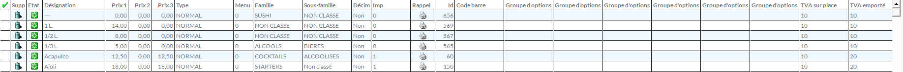
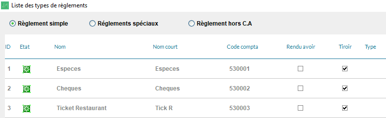

## Produits {#products}

Pour retrouver le code ref d'un produit, procédez comme suit :

1. Depuis l'écran principal de Clyo, sélectionnez **Paramètres**.
1. Dans le menu **Article**, cliquez sur **Gestion des articles**.
1. Le code ref de chaque produit s'affiche dans la colonne **Id**.
   

## Remises

Les remises dans HubRise sont créés comme des produits à prix libre négatif dans Clyo Systems. Pour retrouver le code ref d'une remise, procédez comme pour les [produits](#products).

## Frais

Les frais de livraison ou de service doivent être créés comme des produits à prix libre positif dans Clyo Systems. Pour trouver le code ref des frais, procédez comme pour les [produits](#products).

## Méthodes de paiement

Les méthodes de paiement dans HubRise correspondent aux types de règlement dans Clyo Systems. Pour retrouver leur code ref, suivez ces étapes :

1. Depuis l'écran principal de Clyo, sélectionnez **Paramètres**.
1. Dans le menu **Paramètres**, cliquez sur **Gestion règlement**.
1. Le code ref de chaque méthode de paiement s'affiche dans la colonne **ID**.
   
