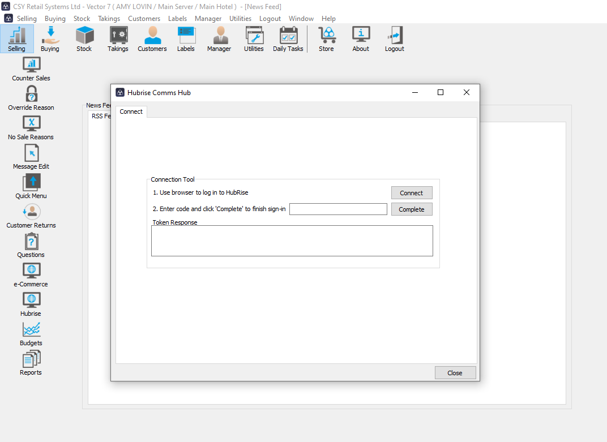
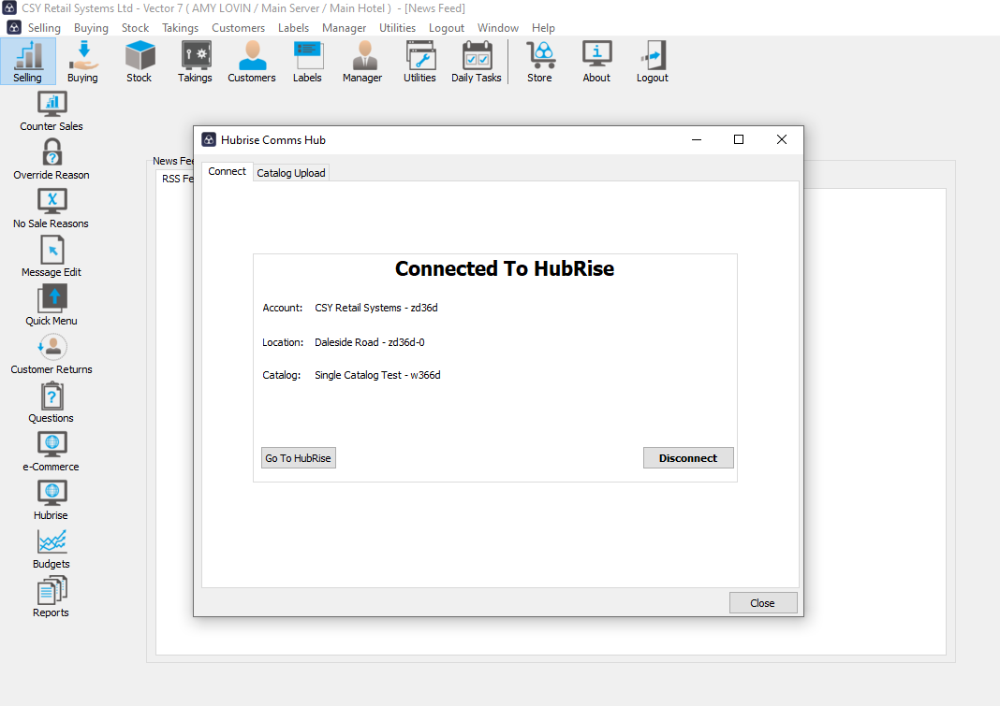

---

**IMPORTANT NOTE:** If you do not have a HubRise account yet, register on our [Signup Page](https://manager.hubrise.com/signup). It only takes a minute!

---

## Connect CSY Vector EPOS

To ask the CSY support team to connect your Vector EPOS to HubRise, proceed as follows:
1. Grant CSY support access to your HubRise account. For more information, see [Grant Access to CSY Support](#give-access).
1. Contact the CSY support team who will establish the connection to HubRise. For more information, see [Contact CSY Support](#contact).

To connect Vector EPOS to HubRise autonomously, follow these steps:
1. Ask the CSY support team to enable the HubRise add-on. For more information, see [Contact CSY Support](#contact).
1. Once the HubRise add-on is activated, go to the Vector EPOS back office. In the left-hand menu, click **HubRise**, then select **HubRise Communication Hub**.
1. Step 1, next to **Use browser to log in to HubRise**, click the **Connect** button. You will be redirected to the HubRise interface in your web browser.
1. Find HubRise in your internet web browser. If this is your first time logging in, create a HubRise account. For more information, check out our [Getting Started Guide](/docs/get-started).
1. If your account has multiple locations, expand the **Choose location** section to select the desired location, and click **Allow**. For locations with multiple customer lists or catalogs, click **Next** to display the corresponding dropdown lists, and select the desired options.
1. HubRise will display a code. Click the copy icon to copy it, then return to the Vector EPOS back office. 
1. Step 2, in the HubRise **Comms Hub panel**, enter the code and click **Complete**.
1. When you see **Connected To HubRise**, the connection to HubRise is established.

## Grant Access to CSY Vector EPOS Support {#give-access}

To connect Vector EPOS and facilitate the handling of your support requests, you need to grant your CSY provider access to your HubRise account.

To grant access to CSY, proceed as follows:

1. From the HubRise back office, select **SETTINGS** in the left-hand menu.
1. In the **Permissions** section, enter `helpdesk@csy.co.uk`.
1. Click on **Add User**.
1. In the dropdown menu for selecting a predefined role, select **Technical Partner**.
1. Click on **Set Permissions**.

Adding a user is the recommended way to grant access to a third party to your HubRise account or location. Sharing passwords is not recommended for security reasons. For more information on permissions, see the [Permissions](/docs/permissions) help page.

## Contact CSY Support {#contact}

To request the HubRise add-on, oo ask the CSY support team to connect your EPOS, contact CSY support by email at helpdesk@csy.co.uk. You can include support@hubrise.com in copy for a coordinated follow-up between our two teams.

Include in your request the name of your HubRise account, its HubRise identifier and the location to connect. For more information, see [Location Name and ID](/docs/locations#location-name-and-id).

## Disconnect CSY Vector EPOS

To disconnect CSY Vector EPOS from HubRise, proceed as follows:

1. From the Vector EPOS back office, click **HubRise** in the left-hand side, then select **HubRise Communication Hub**.
1. In the **Connected to HubRise** pane, click on the **Disconnect** button. 
1. You are disconnected from HubRise.

If you just need to temporarily stop [receiving orders from HubRise], you can block the connection between CSY Vector EPOS and HubRise. For more information, see [Block or Disconnect App](/docs/connections#block-or-disconnect).

