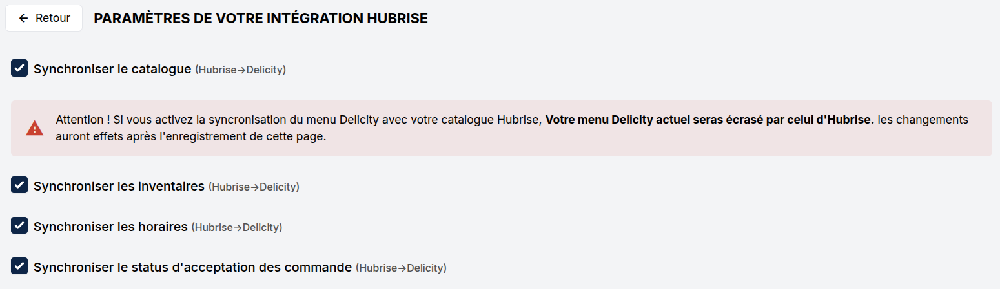
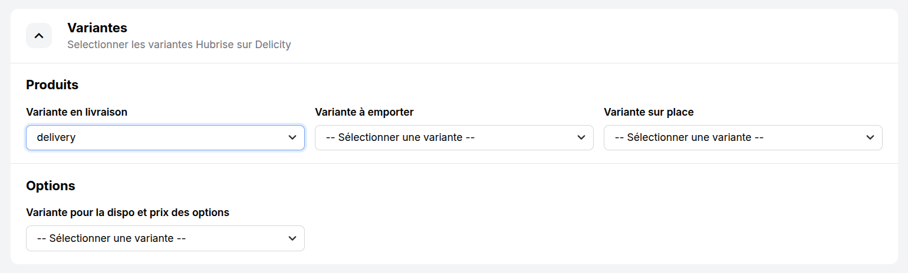
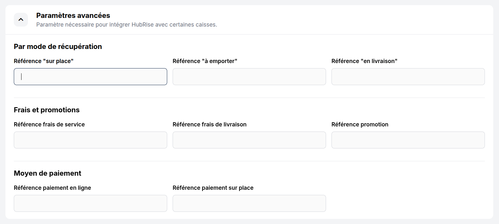

La page de configuration permet de paramétrer l'intégration entre Delicity et HubRise. Elle est accessible depuis le back-office de Delicity.

Pour accéder à la page de configuration, procédez comme suit :

1. Depuis le back-office de Delicity, cliquez sur **Intégrations**.
1. Dans la section **HubRise**, cliquez sur **Paramètres**.
1. Effectuez les modifications nécessaires.
1. Cliquez sur **Enregistrer** pour valider vos modifications.

## Paramètres de synchronisation {#sync-settings}

Cette section permet de configurer la synchronisation automatique des données HubRise vers Delicity.

Les options suivantes permettent d'activer ou de désactiver la synchronisation pour chaque type de données :

- **Synchroniser le catalogue** : récupérer automatiquement le catalogue HubRise dans Delicity.
- **Synchroniser les inventaires** : récupérer automatiquement la disponibilité des produits et des options lorsque l'inventaire HubRise est modifié.
- **Synchroniser les horaires** : récupérer automatiquement les heures d'ouverture depuis HubRise.
- **Synchroniser le statut d'acceptation des commandes** : récupérer automatiquement le statut d'acceptation des commandes (normal ou en pause) et le temps de préparation définis au niveau du point de vente HubRise.

Lorsqu'une synchronisation est activée, Delicity effectue immédiatement une synchronisation initiale des données concernées.

---

**REMARQUE IMPORTANTE :** L'activation de la synchronisation du catalogue remplacera immédiatement votre menu Delicity actuel par le catalogue HubRise connecté. Assurez-vous que votre catalogue HubRise est correctement configuré avant d'activer cette option.

---

## Variantes

Les variantes permettent de définir des prix et des disponibilités différents dans un catalogue HubRise selon le contexte de commande.

Si aucune variante n'est sélectionnée dans un menu déroulant, les prix et disponibilités par défaut du catalogue HubRise seront utilisés.

### Produits

Delicity supporte des prix différenciés pour les produits selon le type de commande :

- **Variante en livraison** : variante utilisée pour les commandes en livraison.
- **Variante à emporter** : variante utilisée pour les commandes à emporter.
- **Variante sur place** : variante utilisée pour les commandes sur place.

### Options

Delicity utilise un prix unique pour les options, quel que soit le type de commande. La liste déroulante **Variante pour la dispo et prix des options** permet de sélectionner la variante à utiliser pour ces options.

## Paramètres avancés

Cette section permet de configurer les codes ref nécessaires pour intégrer HubRise avec certaines caisses.

---

**REMARQUE IMPORTANTE :** Pour obtenir les codes ref à utiliser dans cette section, consultez la documentation de votre logiciel de caisse sur le site internet de HubRise.

---

### Par mode de récupération

Les types de service tels que la livraison, la vente à emporter et la consommation sur place peuvent nécessiter la saisie du code ref correspondant dans votre logiciel de caisse.

- **Référence "sur place"** : code ref du type de service "sur place".
- **Référence "à emporter"** : code ref du type de service "à emporter".
- **Référence "en livraison"** : code ref du type de service "en livraison".

### Frais et promotions

Si des frais ou des promotions s'appliquent, un code ref peut être requis par votre logiciel de caisse :

- **Référence frais de service** : code ref pour les frais de service.
- **Référence frais de livraison** : code ref pour les frais de livraison.
- **Référence promotion** : code ref pour les remises.

### Moyen de paiement

Les moyens de paiement doivent être identifiés par des codes ref spécifiques dans votre logiciel de caisse.

- **Référence paiement en ligne** : code ref pour les paiements effectués en ligne sur Delicity.
- **Référence paiement sur place** : code ref pour les paiements effectués sur place.
