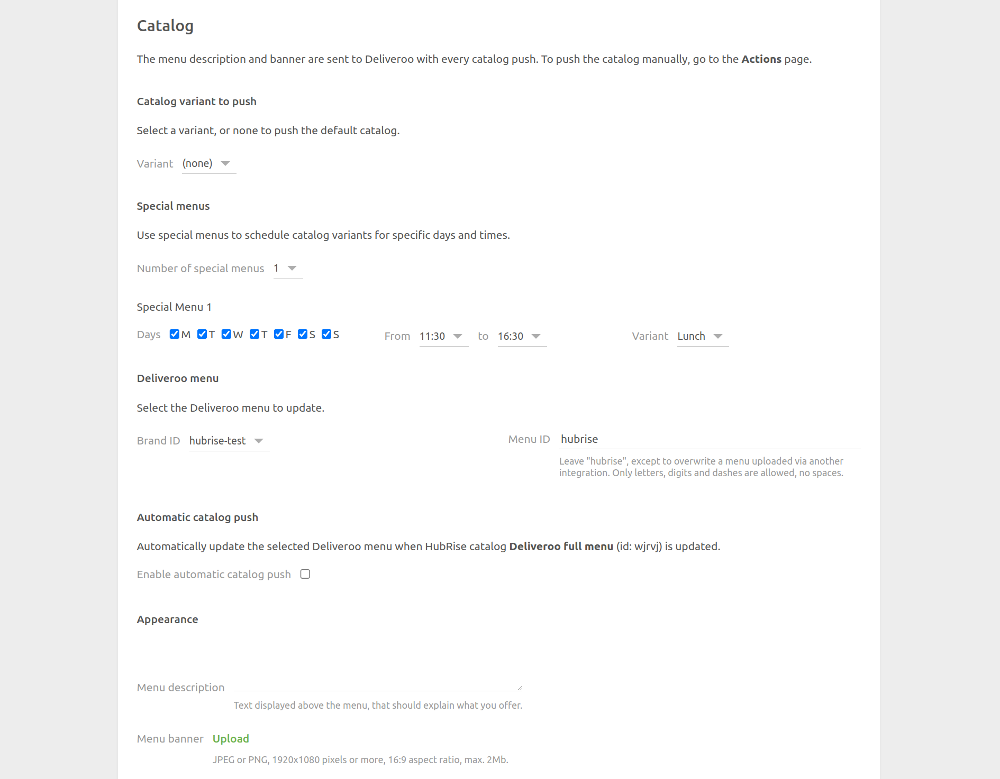

The configuration page allows you to customise the behaviour of Deliveroo Bridge based on your preferences.
These are divided into different sections for an easier navigation.

## Language

Choose the language to use for generic items such as `Delivery charge`. These names may appear in your EPOS and in customer receipts.

## Orders

### Order Statuses

Deliveroo requires you to acknowledge every order you receive. In this section, you can select which HubRise status sends an order confirmation back to Deliveroo. Refer to your EPOS documentation on the HubRise website to verify the correct value.

### Service Types

Service types such as delivery by Deliveroo, restaurant delivery or takeaway might require the corresponding ref code entry. Refer to your EPOS documentation on the HubRise website to verify.

Additionally, from this section, you can choose to categorise orders fulfilled by Deliveroo as either delivery or collection orders. Orders fulfilled by the restaurant fleet are always marked as delivery orders. This feature is useful to address specific business requirements or to differentiate these orders in financial reports.

### Discounts

This section allows you to specify the discount ref code applied to your products, in case you have one active on your Deliveroo page. Refer to your EPOS documentation on the HubRise website to see how to obtain the corresponding ref code.

Available discounts on Deliveroo appear in the **All offers** page in your Deliveroo back office.

### Charges

If charges apply, a ref code might be required. Refer to your EPOS documentation on the HubRise website to verify.

In this section, you can specify the ref code for delivery charges, for surcharges applied to orders below the minimum price, and for bag fees.

### Payments

Deliveroo customers can pay for their order either online or by cash for restaurant delivery orders.

This section of the configuration page allows you to specify the ref codes for these two payment methods. Refer to your EPOS documentation on the HubRise website to verify the correct codes to use.

## Customers

Enable the **Duplicate phone access code in delivery notes** option if your EPOS lacks native support for fetching phone access codes.

All EPOS systems integrated with HubRise can read delivery notes. If your EPOS has native support and this option is enabled, the code will appear duplicated. Refer to your EPOS documentation on the HubRise website to verify the correct value.

## Catalog {#catalog}

### Catalog Variant to Push

Catalog variants give you the flexibility to disable specific items or adjust prices for Deliveroo.

If your catalog includes variants, you have the option to select which one to use. When **(none)** is selected, the default items along with their standard prices are used.

### Deliveroo menu

The **Brand ID** and **Menu ID** fields identify the menu you wish to update on Deliveroo. The default values generally work for most users.

### Automatic Catalog Push

Select the **Enable automatic catalog push** checkbox to synchronise your HubRise catalog with Deliveroo whenever it gets updated.

### Appearance

The **Menu description** and **Menu banner** replace the current description and banner image on Deliveroo when you push your catalog. The requirements for the banner image are as follows:

- Minimum resolution of 1920x1080 pixels, 16:9 aspect ratio
- Must be in JPG or PNG format
- File size should be less than 2 MB

---

**IMPORTANT NOTE:** The menu description and banner are required to successfully push your catalog to Deliveroo.

---

## Location

Select the **Enable automatic opening hours push** checkbox to update your opening hours in Deliveroo whenever they get updated in HubRise. 

## Inventory

Through inventory synchronisation, products and options that have a stock quantity of zero can be hidden on your Deliveroo store.

Select the **Enable automatic inventory push** checkbox to synchronise your HubRise inventory with Deliveroo whenever it gets updated.

## Save the Configuration

To save the configuration, click **Save** at the top of the page.

## Reset the Configuration

If you need to reset the configuration, click **Reset the configuration** at the bottom of the page.

---

**IMPORTANT NOTE:** Resetting the configuration will instantly disconnect the bridge from Deliveroo. You will need your Deliveroo Restaurant ID to reestablish the connection.

---

Resetting the configuration does not delete the operation logs displayed in the main page.
