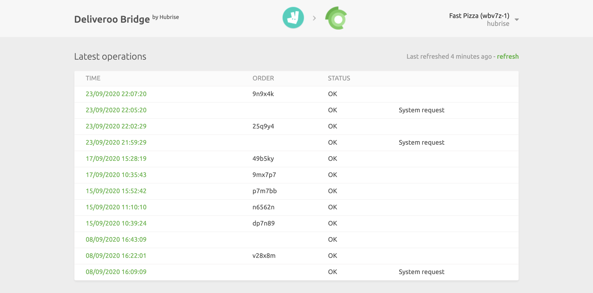
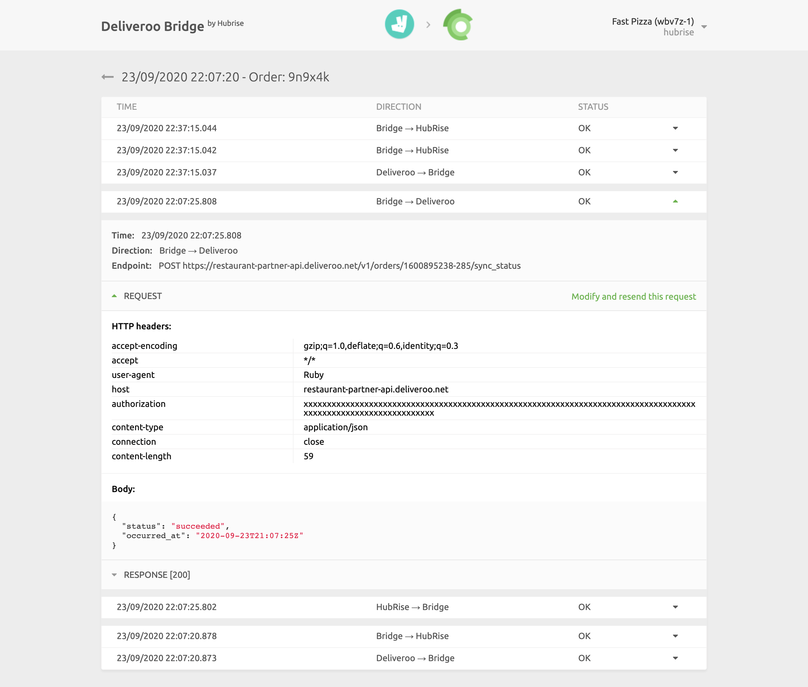
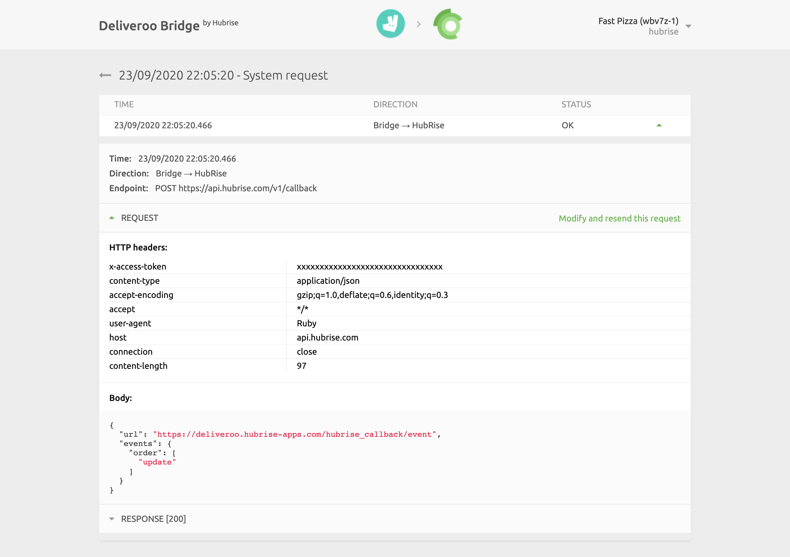

From the main page of Deliveroo Bridge, you can read the logs of all the operations between HubRise and Deliveroo, and access the configuration settings of the integration.

## Operations Page

The main page displays the latest API operations between HubRise, Deliveroo, and Deliveroo Bridge.

Operations can either be related to a specific order, or be generic system requests performed by Deliveroo Bridge.

Each row in the page shows the following information about an operation:

- **TIME**: The date and time of the order.
- **ORDER**: The HubRise order ID, for order operations.
- **STATUS**: The status of the order. The value OK indicates that the order has been successfully sent, otherwise a message will explain the type of error occurred.

The **System request** label indicates that the operation is not related to a specific order.

Clicking on a row will open a new page displaying the logs associated with the operation.

## Orders Page

Selecting an order operation from the list in the main page will display all the logs of the API requests exchanged between HubRise and Deliveroo via Deliveroo Bridge.

Requests are ordered with the latest on top, and those related to the same order event (order received, order cancelled, etc.) are visually grouped together.

Each row in the logs displays the following information:

- **TIME**: The date and time the request was sent.
- **DIRECTION**: The apps sending and receiving the request, in the format Origin → Destination.
- **STATUS**: The status of the request. The value OK indicates that the request has been successfully received, otherwise a message will explain the type of error occurred.

Clicking on a request will expand it to reveal the detailed logs of the request and its response.

Logs are a powerful debugging tool in case of issues. To understand in detail how to read logs, see the [HubRise documentation](/docs/hubrise-logs/).

## System Request Page

The layout of a system request page is identical to that of an order page.

System requests are generally sent by Deliveroo Bridge to notify HubRise about a change in the configuration or to populate the UI with the most up-to-date information. As an example, the following image displays a request to update the Deliveroo Bridge callback after a configuration change.

System request pages can provide useful debugging insights to support teams, but are rarely of interest to other users.

## Language and Navigation

At the top right corner of the main page, you can click on the arrow <InlineImage width="20" height="20"></InlineImage> to expand the menu. From there, you can change the language of the page to English or French.

Clicking on the Deliveroo and HubRise logos on top of any page of Deliveroo Bridge will bring you back to the main page.

## Configuration Page

To access the Deliveroo Bridge Configuration page, click on the arrow <InlineImage width="20" height="20"></InlineImage> at the top right corner of the page to expand the menu, then click **Configuration**.

From this page, you will be able to customise the behaviour of Deliveroo Bridge. For more details, see [Configuration](/apps/deliveroo/configuration).
