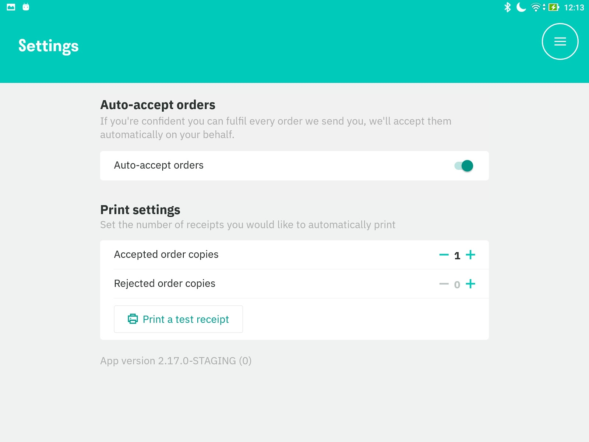

If you want to leave the Deliveroo tablet aside to free up your restaurant staff from managing it and avoid the risk of order rejections, you have two options available.

## Set Up Tabletless Mode
The first option is to set up the integration to the tabletless mode. To activate this mode, contact us at [support@hubrise.com](mailto:support@hubrise.com) or reach out to your Deliveroo Account Manager. 

Once activated, you can leave the Deliveroo tablet turned off or not have one at the restaurant at all. 

Using the tabletless mode can help create more counter space, which is especially useful if you manage multiple brands on Deliveroo from the same location. It is also essential if you operate a ghost kitchen.

## Enable Auto-Accept

The second option is to enable auto-accept by selecting **Turn on Auto-accept** on your Deliveroo tablet every day when you open your restaurant. 

---

**IMPORTANT NOTE:** With auto-accept enabled, you need to keep the tablet turned on to receive orders on HubRise or your connected EPOS.

---

You can also turn auto-accept on or off at any time from the tablet's **Settings** page.

Choose the option that works best for your restaurant's needs to streamline your order management process.