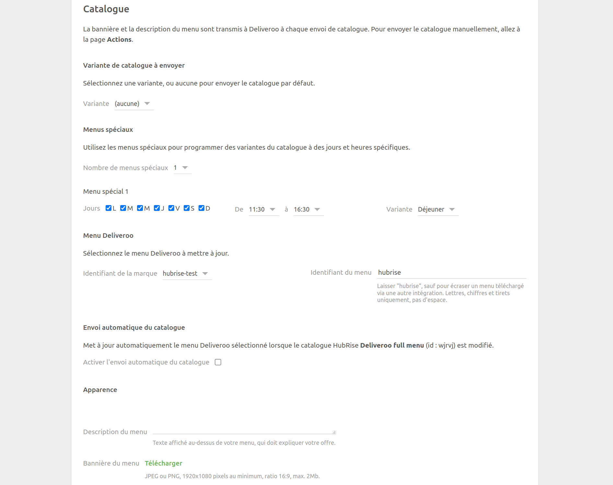

La page de configuration permet de personnaliser le comportement de Deliveroo Bridge. Elle est divisée en plusieurs sections pour faciliter la navigation.

## Langue

Choisissez la langue à utiliser pour les éléments génériques tels que les `Frais de livraison`. Ces noms peuvent apparaître dans votre logiciel de caisse et sur les reçus des clients.

## Commandes

### Statuts de commande

Deliveroo exige un accusé de réception pour chaque commande envoyée. Dans cette section, vous pouvez sélectionner le statut HubRise qui envoie l'accusé de réception à Deliveroo. Reportez-vous à la documentation de votre logiciel de caisse sur le site internet de HubRise pour trouver la valeur à utiliser.

### Types de service

Les types de service tels que la livraison par Deliveroo, la livraison par le restaurant ou la vente à emporter peuvent nécessiter la saisie du code ref correspondant. Reportez-vous à la documentation de votre logiciel de caisse sur le site internet de HubRise pour vérifier.

Dans cette section, vous pouvez également choisir de marquer les commandes livrées par Deliveroo comme étant en livraison ou à emporter. Les commandes livrées par le restaurant sont toujours marquées comme des commandes en livraison. Cette fonctionnalité permet de répondre à des besoins spécifiques de votre entreprise ou à différencier ces commandes dans les rapports d'activité.

### Articles spéciaux

Certains marchés comme l'Irlande exigent des acomptes sur certains articles. Si votre activité le nécessite, vous pouvez spécifier le code ref de l'acompte dans cette section. L'acompte doit d'abord être créé en tant qu'option dans votre logiciel de caisse. Une fois configuré, il est automatiquement ajouté à tous les articles nécessitant un acompte.

### Remises

Cette section permet de spécifier le code ref de la remise appliquée à vos produits, dans le cas où utilisez des offres sur Deliveroo. Pour obtenir le code ref correspondant, reportez-vous à la documentation de votre logiciel de caisse sur le site internet de HubRise.

Les promotions disponibles sur Deliveroo apparaissent sur la page **Toutes les offres** de votre back-office Deliveroo.

### Frais

Si des frais s'appliquent, un code ref peut être nécessaire. Reportez-vous à la documentation de votre logiciel de caisse sur le site internet de HubRise pour vérifier.

Dans cette section, vous pouvez spécifier le code ref des frais de livraison, des suppléments appliqués aux commandes de petit montant, ainsi que des frais d'emballage.

### Paiements

Les clients Deliveroo peuvent régler leur commande en ligne ou en espèces lorsque le restaurant prend en charge la livraison.

Cette section de la page de configuration permet de spécifier les codes ref pour les deux types de paiement. Pour connaître les codes à utiliser, consultez la documentation de votre logiciel de caisse sur le site internet de HubRise.

## Clients

Activez l'option **Dupliquer le code d'accès téléphone dans les notes de livraison** si votre logiciel de caisse ne supporte pas nativement la récupération des codes d'accès au téléphone.

Tous les systèmes de caisse intégrés à HubRise peuvent lire les bons de livraison. Si votre logiciel de caisse dispose d'un support natif et que cette option est activée, le code apparaîtra dupliqué. Reportez-vous à la documentation de votre logiciel de caisse sur le site internet de HubRise pour trouver la valeur à utiliser.

## Catalogue {#catalog}

### Variante de catalogue à envoyer

Les variantes de catalogue vous donnent la flexibilité de désactiver des articles ou d'ajuster les prix spécifiquement pour Deliveroo.

Si votre catalogue comprend des variantes, vous pouvez sélectionner celle que vous souhaitez utiliser. Lorsque **(aucune)** est sélectionné, les articles par défaut ainsi que leurs prix standards sont utilisés.

### Menu Deliveroo

Les champs **Identifiant de la marque** et **Identifiant du menu** identifient le menu que vous souhaitez mettre à jour sur Deliveroo. Les valeurs par défaut fonctionnent généralement pour la plupart des utilisateurs.

### Envoi automatique du catalogue

Sélectionnez la case **Activer l'envoi automatique du catalogue** pour synchroniser votre catalogue HubRise avec Deliveroo chaque fois qu'il est mis à jour.

### Apparence

La **description du menu** et la **bannière du menu** remplacent la description et la bannière courantes sur Deliveroo lorsque vous envoyez votre catalogue. Les spécifications de l'image de la bannière sont les suivantes :

- Résolution minimale de 1920x1080 pixels, format 16:9
- Format JPG ou PNG
- Taille du fichier inférieure à 2 Mo

---

**REMARQUE IMPORTANTE :** La description et la bannière du menu sont nécessaires pour envoyer votre catalogue à Deliveroo.

---

## Point de vente

Sélectionnez la case **Activer l'envoi automatique des horaires d'ouverture** pour mettre à jour vos horaires d'ouverture dans Deliveroo chaque fois qu'ils sont mis à jour dans HubRise.

## Inventaire

Grâce à la synchronisation de l'inventaire, les produits et options dont la quantité en stock est nulle peuvent être masqués sur votre restaurant Deliveroo.

Sélectionnez la case **Activer l'envoi automatique de l'inventaire** pour synchroniser votre inventaire HubRise avec Deliveroo chaque fois qu'il est mis à jour.

## Enregistrer la configuration

Pour enregistrer la configuration, cliquez sur **Enregistrer** en haut de la page.

## Réinitialiser la configuration

Si vous avez besoin de réinitialiser la configuration, cliquez sur **Réinitialiser la configuration** en bas de la page.

---

**REMARQUE IMPORTANTE :** La réinitialisation de la configuration déconnectera instantanément le bridge de Deliveroo. Vous aurez besoin de votre identifiant de restaurant Deliveroo pour rétablir la connexion.

---

La réinitialisation de la configuration ne supprime pas les fichiers journaux des opérations affichés sur la page principale.
