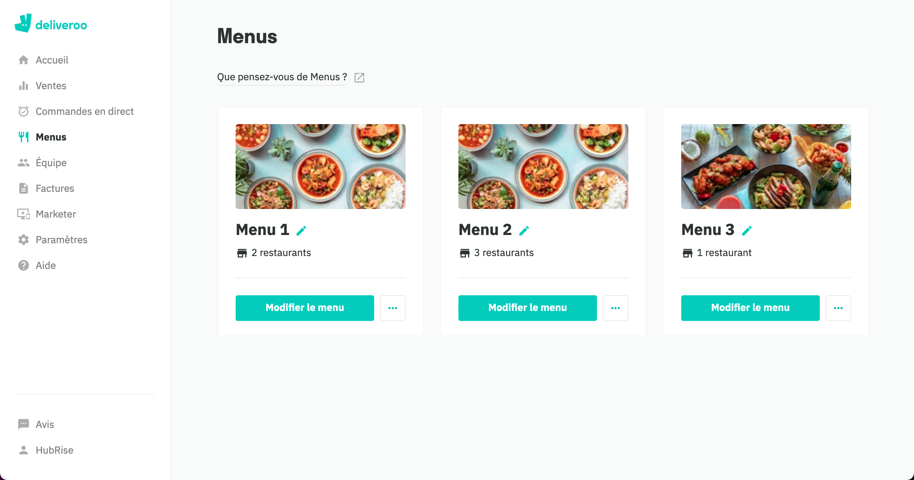
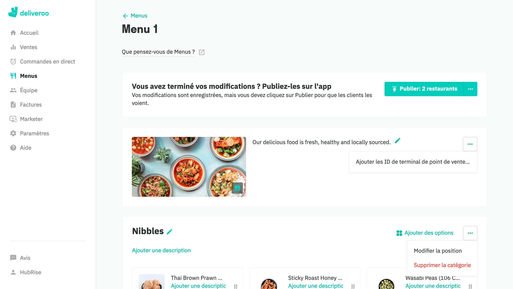
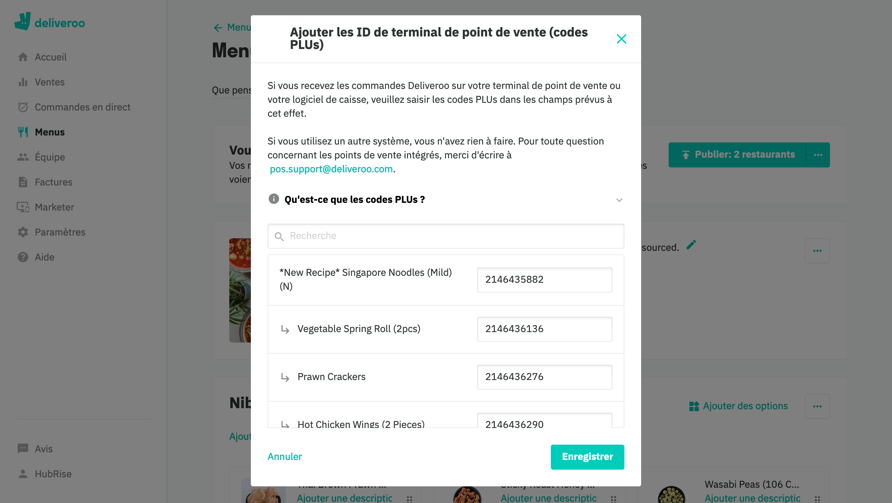
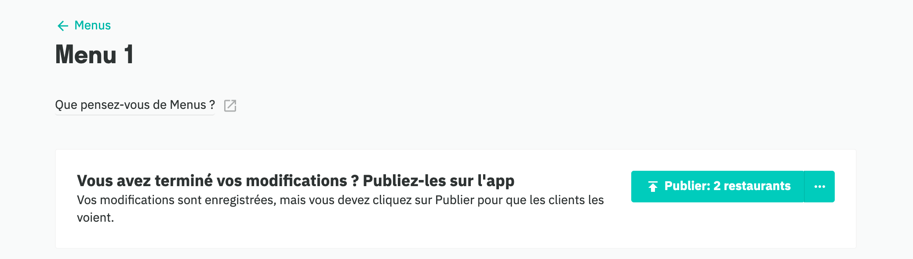

Pour traiter correctement les commandes, la plupart des logiciels de caisse exigent un code ref pour chaque produit et chaque option. Lorsque vous créez votre menu sur Deliveroo, vous devez donc vous assurer que chaque produit et option est associé à un code ref correct.

---

**REMARQUE IMPORTANTE :** Omettre des codes ref peut empêcher Deliveroo de traiter correctement la commande. Pour plus d'informations, consultez la section [Commandes non reçues](/apps/deliveroo/troubleshooting#orders-not-received) de la page Dépannage.

---

Pour attribuer des codes ref à vos produits Deliveroo en passant par l'outil de gestion de menus du back-office Deliveroo, procédez comme suit :

1. Connectez-vous à votre [back-office Deliveroo](https://restaurant-hub.deliveroo.net).
1. Dans le menu de gauche, sélectionnez **Menus**.
1. Cliquez sur **Modifier le menu**. Si plusieurs menus existent, assurez-vous que celui que vous modifiez est le bon. 
1. Cliquez sur le symbole <InlineImage width="24" height="24"></InlineImage> à côté de la description du menu, puis sélectionnez **Ajouter les ID de terminal de point de vente (codes PLUs)**. Assurez-vous de ne pas cliquer par inadvertance sur le bouton d'ellipse situé à côté d'une catégorie d'articles. 
1. Saisissez le code ref correct pour chaque produit de la liste.
1. Cliquez sur **Enregistrer** pour confirmer l'association.
1. Cliquez sur **Publier** pour finaliser votre association. Les modifications apportées au menu seront accessibles en ligne une fois qu'elles auront été publiées. 

---

**REMARQUE IMPORTANTE :** Pour pouvoir saisir manuellement des codes ref dans le gestionnaire de menus Deliveroo, votre compte Deliveroo ne doit pas être configuré pour mettre à jour les codes ref via l'API Menu. Pour réactiver le gestionnaire de menus et afficher les champs PLU dans votre back-office Deliveroo, contactez restaurants@deliveroo.fr.

---
