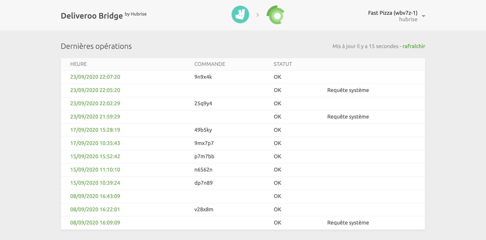
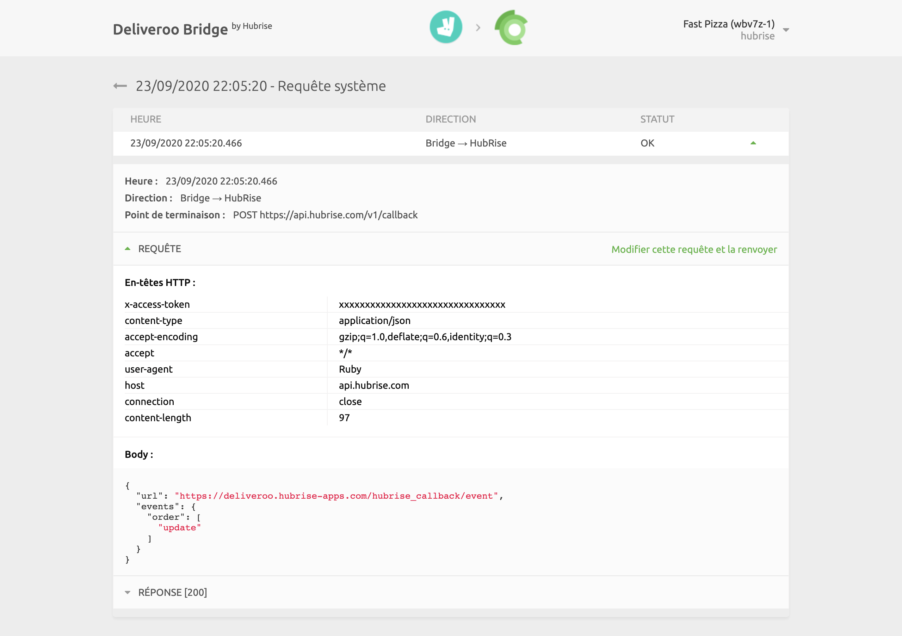

Depuis Deliveroo Bridge, vous pouvez consulter les requêtes d'API échangées entre HubRise et Deliveroo, et accéder à la page de configuration de l'intégration.

## Dernières opérations

Il s'agit de la page par défaut lorsque vous ouvrez Deliveroo Bridge. Elle affiche les dernières opérations d'API échangées entre HubRise, Deliveroo et Deliveroo Bridge.

Les opérations peuvent soit être liées à une commande spécifique, soit être des requêtes système génériques exécutées par Deliveroo Bridge.

Chaque ligne de cette page affiche les informations relatives à une opération :

- **HEURE** : date et heure de la commande.
- **COMMANDE** : identifiant de la commande HubRise, pour les opérations de commande.
- **DESCRIPTION** : Une description facultative pour les opérations qui ne sont pas liées à une commande spécifique. Il peut être vide, ou informé par une `Requête système` ou un `Envoi catalogue`.
- **STATUT** : statut de la commande. La valeur `OK` indique que la commande a été envoyée avec succès. Dans le cas contraire, un code d'erreur s'affiche en rouge.

Le libellé **Requête système** indique que l'opération n'est pas liée à une commande spécifique.

En cliquant sur une ligne, vous ouvrez une nouvelle page affichant les fichiers journaux associés à l'opération.

### Opération de commande

La sélection d'une opération de commande dans la liste qui figure sur la page principale affiche tous les fichiers journaux des requêtes d'API échangées entre HubRise et Deliveroo via Deliveroo Bridge.

Les requêtes sont classées par ordre chronologique inverse, et les requêtes liées au même événement de commande (commande reçue, commande annulée, etc.) sont regroupées visuellement.

Chaque ligne de requête d'API contient les informations suivantes :

- **Heure** : date et l'heure d'envoi de la requête.
- **Direction** : applications qui envoient et reçoivent la requête, selon le format Origine → Destination.
- **Point de terminaison** : point de terminaison de la requête. La valeur `OK` indique que la requête a été reçue avec succès. Dans le cas contraire, un message explique le type de l'erreur qui est survenue.

Cliquez sur une requête pour la développer et révéler le détail des échanges.

Les requêtes d'API sont un bon outil de débogage en cas d'incident. Pour comprendre comment lire ces requêtes, voir [Comprendre les logs HubRise](/docs/hubrise-logs/overview).

### Opération de requête système

La mise en page d'une page de requête système est identique à celle d'une page de commande.

Les requêtes système sont généralement envoyées par Deliveroo Bridge afin d'informer HubRise d'une modification de la configuration, ou bien pour alimenter l'interface utilisateur avec les informations les plus récentes. À titre d'exemple, l'image suivante illustre une requête de mise à jour du rappel de Deliveroo Bridge après un changement de configuration.

Les pages de requête système fournissent des informations de débogage utiles aux équipes d'assistance, mais elles sont généralement peu utiles pour les autres utilisateurs.

## Configuration {#configuration}

Pour accéder à la page de configuration, cliquez sur **Configuration** en haut de l'écran.

Cette page vous permet de personnaliser le comportement de Deliveroo Bridge. Pour plus d'informations, voir [Configuration](/apps/deliveroo/configuration).

## Actions

Pour accéder à la page d'actions, cliquez sur **Actions** en haut de l'écran. Si le lien n'est pas visible, terminez d'abord la configuration de Deliveroo Bridge.

Depuis la page **Actions**, vous pouvez effectuer les actions suivantes :

- **Envoyer le catalogue** : envoie le catalogue vers Deliveroo. Pour plus d'informations, voir [Envoyer le catalogue](/apps/deliveroo/push-catalog).
- **Récupérer le catalogue**: importe le menu depuis Deliveroo vers un catalogue HubRise. Pour plus d'informations, voir [Récupérer le catalogue](/apps/deliveroo/pull-catalog).
- **Envoyer l'inventaire**: pousse votre inventaire HubRise vers Deliveroo.

## Langue et navigation

Dans le coin supérieur droit de la page, vous pouvez cliquer sur la flèche <InlineImage width="20" height="20"></InlineImage> pour développer le menu déroulant. De là, vous pouvez alterner l'affichage de la page en anglais ou en français.

Pour revenir à la page **Dernières opérations**, cliquez sur les logos de Deliveroo et de HubRise en haut de n'importe quelle page de Deliveroo Bridge.
