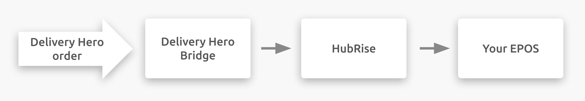

---

**IMPORTANT NOTE:** Full documentation of this integration will be available soon.

---

## Description

Delivery Hero is an online food ordering and home delivery platform for restaurants and convenience stores.

Customers can order online or via a mobile app.

Delivery Hero is present in more than 50 countries in Europe, Asia, Latin America and the Middle East. Delivery Hero is not present in the United Kingdom.

Delivery Hero's activity is carbon-neutral in Europe and Latin America.

## Integration features

Connecting Delivery Hero Bridge allows HubRise to:

- Pull orders from Delivery Hero, including order status.
- Pull delivery information from Delivery Hero, for orders delivered by the restaurant.

## Why connect?

By connecting Delivery Hero to HubRise, your delivery platform can communicate with your other everyday applications. You can push online orders to your EPOS, your connected printer, your kitchen display screen or your inventory management solution.

With HubRise, you can synchronise your menu, customer information, and orders between your EPOS, your online ordering solution, food delivery platforms (including Deliveroo, Uber Eats, and Just Eat), delivery management solutions or delivery services, eMarketing solutions (SMS/emailing), business intelligence, inventory, and customer loyalty systems, and much more. The number of compatible applications increases every month. To discover the apps you can connect, visit our [Apps page](/apps).

## Prerequisites

You must be a Delivery Hero partner in order to establish the connection between Delivery Hero and HubRise.
