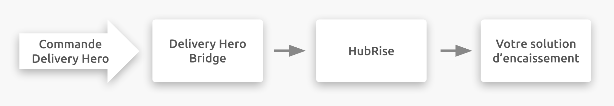

---

**REMARQUE IMPORTANTE :** Une documentation complète de cette intégration sera bientôt disponible.

---

## Description

Delivery Hero est une plateforme de commande de repas avec service de livraison à domicile, destinée aux restaurants et aux commerces de proximité.

Les clients commandent en ligne ou via une application mobile.

Delivery Hero est présent dans plus de 50 pays situés en Europe, en Asie, en Amérique latine, et au Moyen-Orient. Delivery Hero n'est pas présent en France.

L'activité de Delivery Hero est neutre en dioxyde de carbone en Europe et en Amérique latine.

## Fonctionnalités de l'intégration

Connecter Delivery Hero à HubRise permet à votre plateforme de livraison de repas de :

- Envoyer les commandes à HubRise, dont les statuts de commande.
- Envoyer les informations de livraison, pour les commandes livrées par votre équipe.

## Pourquoi se connecter ?

En connectant Delivery Hero à HubRise, vous permettez à votre plateforme de livraison de repas de communiquer avec les autres applications que vous utilisez de manière quotidienne. Envoyez les commandes en ligne vers votre logiciel de caisse, une imprimante autonome, un écran cuisine, ou votre système de gestion de stock.

Avec HubRise, vous pouvez synchroniser votre menu, vos informations clients et vos commandes entre votre logiciel de caisse, votre solution de commande en ligne, les services de livraison de repas (y compris Deliveroo, Uber Eats et Just Eat), les solutions de gestion de livreurs, les services de livraison, les solutions d'e-marketing (SMS/emailing), les systèmes de business intelligence, de gestion des stocks et de fidélisation client, et bien plus encore. Le nombre d'applications compatibles augmente chaque mois. Pour découvrir les applications que vous pouvez connecter, visitez notre [page Apps](/apps).

## Prérequis

Pour établir la connexion entre Delivery Hero et HubRise, vous devez être un partenaire Delivery Hero.
