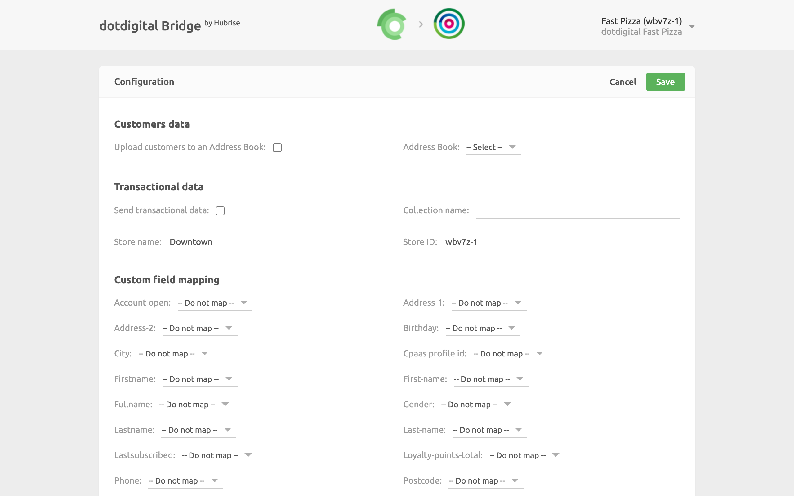

After you connect the dotdigital Bridge to HubRise, you will be asked to configure the app.

## API Credentials

---

**IMPORTANT NOTE:** In order to connect your dotdigital account to HubRise, you need to provide valid API credentials. See [Connection to HubRise](/apps/dotdigital/connect-hubrise) for instructions on how to create an API managed user.

---

In the first configuration page, you will need to enter the email and password for the API managed user of your dotdigital account.

These are necessary to authenticate each request you send to the dotdigital account.

Once you are finished, click **Save**.

## Configuration Page

When the connection to the dotdigital account is established, you will be redirected to the configuration page of the dotdigital Bridge.

On the top right corner of the page, you will see the name and id of your HubRise account, and the name of the dotdigital account.

The Configuration page allows you to customise the behaviour of the dotdigital Bridge based on your preferences.
These are divided into different categories for an easier navigation.

### Customers Data

From this section, you can decide whether to upload your customers to a specific address book. The available address books on your dotdigital account will automatically appear on the dropdown menu on the right.

### Transactional Data

Every time a customer places an order, you can decide to upload it as transactional data to your dotdigital account. To activate this functionality, select the **Send transactional data** checkbox.

You can freely specify the name of the collection to which transactional data will be sent. However, to take full advantage of dotdigital Insight data features, the collection name should be _orders_. For more information, see the [dotdigital guide on using Insight data](https://support.dotdigital.com/hc/en-gb/articles/212214538-Using-Insight-data-developers-guide-#Data%20schema).

You can also customise how the store name and id will appear on transactional data records. The default values are HubRise store name and id.

### Custom Field Mapping

When you upload a customer's details to dotdigital, your dotdigital data model might use different names to indicate data fields from those used by HubRise.

This section of the Configuration page allows you to decide how to map your dotdigital data fields to HubRise. You can also decide not to map a specific field by selecting the **-- Do not map --** value from the dropdown menu.

### Saving the Configuration

Once you are happy with the configuration of the dotdigital Bridge, click **Save** at the top of the page to continue to the main page.

## Resetting the Configuration

You can always restore the Configuration page to its default values and change the dotdigital API credentials associated with your HubRise location by clicking on **Reset the configuration**.

## Uploading Customers in Bulk

From the **Actions** section of the Configuration page, you can **Export** all your HubRise customers to dotdigital in bulk. If you choose to upload customers to an address book, the bulk upload will use the address book you specified at the top of the Configuration page.

Note that this actions only uploads the customers' details, but not the past transactional data associated with them.
