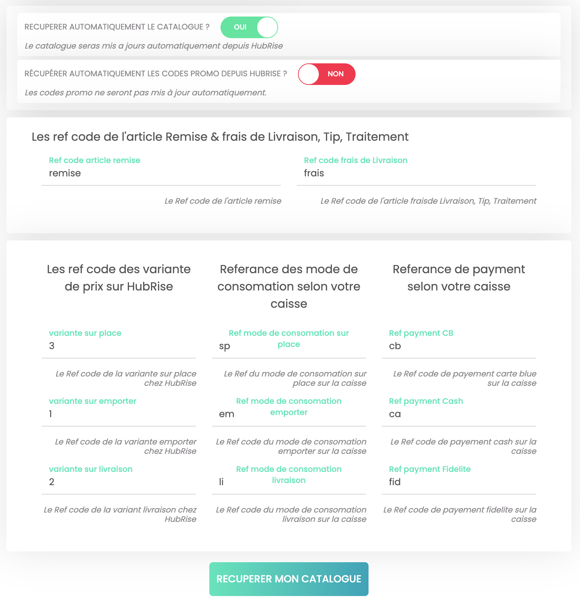

La connexion de Eatself s’effectue en quelques étapes simples et rapides. Il est toutefois nécessaire de réaliser quelques réglages pour que la connexion se comporte exactement comme vous le souhaitez.

Si vous connectez Eatself à un logiciel de caisse via HubRise, vous devrez utiliser des codes ref spécifiques. Ces codes permettent d’identifier de manière unique les produits, les remises, les frais, ou encore les moyens de paiement, afin que toutes les données soient correctement interprétées par votre caisse et les autres applications connectées à HubRise.

Pour accéder à la page de configuration Eatself, procédez comme suit :

1. Depuis le back-office de Eatself, cliquez sur le burger menu pour ouvrir la barre de menu à gauche de l'écran.
1. En bas de page, section **RÉGLAGES PAIEMENT**, cliquez sur **Compte HubRise**.
1. Sur la page de configuration, effectuez les modifications nécessaires.
1. Cliquez **ENREGISTRER** pour que les modifications soient prises en compte.

## Remises et frais {#discount-charges}

Tous les éléments du catalogue HubRise ne sont pas transmis par défaut à Eatself, en particulier les **Remises** et les **Frais**. HubRise peut cependant les envoyer automatiquement à chaque envoi de catalogue.
Pour activer cette fonctionnalité, rendez-vous section **RÉCUPÉRER AUTOMATIQUEMENT LES CODES PROMO DEPUIS HUBRISE ?** puis faites glisser le bouton `NON` vers la droite jusqu'à obtenir `OUI`.

## Remises

Section **Code ref article remise** permet de spécifier le code ref de la remise appliquée à vos produits, dans le cas où utilisez des offres sur Eatself. Pour obtenir le code ref correspondant, reportez-vous à la documentation de votre logiciel de caisse sur le site internet de HubRise.

## Frais

Si des frais de livraison, de traitement ou un pourboire s’appliquent, un code ref peut être nécessaire. Reportez-vous à la documentation de votre logiciel de caisse sur le site internet de HubRise pour vérifier.
Section **Ref code frais de livraison** permet de spécifier le code ref correspondant.

## Variantes de catalogue

Il est possible de définir trois types de prix distincts dans un catalogue Eatself : un prix pour la livraison, un autre pour la vente à emporter, et un troisième pour une consommation sur place.
Si vous utilisez des prix différenciés, assurez-vous que les variantes de catalogue nécessaires sont présentes dans HubRise. Pour plus de précisions, voir notre aide en ligne [Variantes de Catalog Manager](https://www.hubrise.com/fr/apps/catalog-manager/variantes).
Section **Code ref des variantes de prix sur HubRise** dans la page de configuration Eatself vous permet de spécifier les codes ref correspondant à chaque variante de catalogue HubRise. Ces codes sont disponibles dans le back-office de gestion des variantes de **Catalog Manager**.

## Types de service

Les types de service tels que la livraison, vente à emporter àu consommation sur place peuvent nécessiter la saisie du code ref correspondant. Reportez-vous à la documentation de votre logiciel de caisse sur le site internet de HubRise pour vérifier.
Pour le configurer, référez-vous à la colonne **Référence des modes de consommation caisse**.

## Paiements

Sur Eatself, les clients peuvent régler leur commande en ligne, en espèces ou par le biais de points de fidélité.
Section **Référence de paiement caisse** permet de spécifier les codes ref pour ces trois types de paiement. Pour connaître les codes à utiliser, consultez la documentation de votre logiciel de caisse sur le site internet de HubRise.

