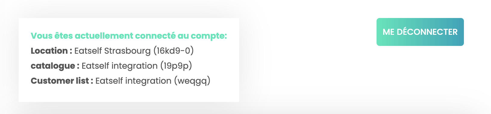

## Connecter Eatself

Pour connecter Eatself à HubRise, suivez ces étapes :

1. Depuis le back-office de Eatself, cliquez sur le burger menu pour ouvrir la barre de menu à gauche de l’écran.
1. En bas de page, section **RÉGLAGES PAIEMENT**, cliquez sur **Compte HubRise**.
1. Cliquez sur le bouton **ME CONNECTER**. Vous êtes redirigé vers l'interface HubRise. S'il s'agit de votre première connexion, créez un compte HubRise. Pour plus d'informations, consultez notre [Guide de démarrage](/docs/get-started). 
1. Si votre compte possède plusieurs points de vente, développez **Choisissez le point de vente**, sélectionnez le point de vente à connecter, puis cliquez sur **Autoriser**. Si le point de vente sélectionné possède plusieurs listes de clients ou catalogues, cliquez sur **Suivant** pour afficher les listes déroulantes correspondantes, puis sélectionnez les options souhaitées.
1. Cliquez sur **Autoriser**.
1. Vous êtes redirigé vers l'interface Eatself et la connexion à HubRise est établie.

---

**REMARQUE IMPORTANTE :** Pour éviter les conflits de statuts ou l'envoi de commandes en double, Eatself ne peut être connecté simultanément à Clyo Systems et à HubRise.

---

## Donner accès au support de Eatself {#give-access}

Pour faciliter le traitement de vos demandes de support, vous devez accorder à votre fournisseur Eatself l'accès à votre compte HubRise.

Pour donner accès à Eatself, procédez comme suit :

1. Depuis le back-office de HubRise, sélectionnez **CONFIGURATION** dans le menu de gauche.
1. Dans la section **Permissions**, ajoutez `support@eatself.com`.
1. Cliquez sur **Ajouter l'utilisateur**.
1. Dans le menu déroulant de choix d'un rôle prédéfini, sélectionnez **Partenaire Technique**.
1. Cliquez sur **Définir les permissions**.

L'ajout d'un utilisateur est le moyen recommandé de donner accès à un tiers à votre compte HubRise ou au point de vente. Le partage de mot de passe est déconseillé pour des raisons de sécurité. Pour plus d'informations sur les permissions, voir notre aide en ligne, page [Permissions](/docs/permissions).

## Déconnecter Eatself

Pour déconnecter Eatself de HubRise, procédez comme suit :

1. Depuis le back-office de Eatself, cliquez sur le burger menu pour ouvrir la barre de menu à gauche de l’écran.
1. Section **RÉGLAGES PAIEMENT** cliquer sur **Compte HubRise**.
1. Cliquez sur le bouton **ME DÉCONNECTER**.
1. Eatself est déconnecté de HubRise.

Si vous souhaitez seulement stopper temporairement l'envoi de commandes Eatself sur HubRise, vous pouvez bloquer la connexion entre Eatself et HubRise. Pour plus d'informations, voir [Bloquer ou déconnecter une application](/docs/connections#block-or-disconnect).
