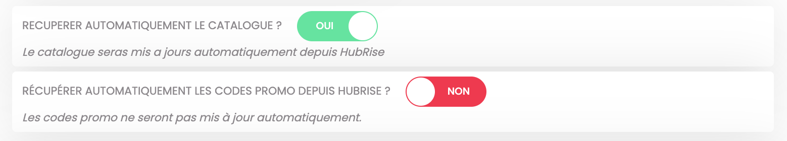

Avec Eatself, vous pouvez envoyer votre catalogue HubRise vers votre restaurant en marque blanche sur Eatself en un seul clic.

Vous pouvez également configurer le bridge de manière à envoyer votre catalogue vers Eatself à chaque fois qu'il est modifié sur HubRise. Pour plus d'informations, voir [Catalogue](/apps/deliveroo/configuration#catalog).

Cette page explique comment envoyer votre catalogue et quelles informations sont envoyées à Eastself.

---

**REMARQUE IMPORTANTE** : L’envoi du catalogue et de l’inventaire va de pair. À chaque envoi de catalogue, l’inventaire correspondant est également transmis. Pour plus de précisions, voir [Inventaire](#inventory)

---

## Alimenter un catalogue HubRise

Pour mettre à jour votre menu Eatself, vous devez préalablement avoir un catalogue dans HubRise. De nombreuses applications connectées à HubRise, notamment les logiciels de caisse, peuvent envoyer leur catalogue vers HubRise. Pour le vérifier, reportez-vous à la documentation de votre logiciel de caisse sur le site internet de HubRise.

Vous pouvez aussi alimenter un catalogue HubRise en récupérant un menu existant depuis Deliveroo ou Uber Eats. Pour plus d'informations, consultez ces liens :

- [Récupérer un catalogue depuis Deliveroo](/apps/deliveroo/pull-catalog)
- [Récupérer un catalogue depuis Uber Eats](/apps/uber-eats/pull-catalog)

## Récupération manuelle du catalogue

Une fois que vous avez alimenté votre catalogue sur HubRise et assigné des codes ref à tous les produits et options, vous pouvez l'envoyer manuellement vers Eatself en suivant ces étapes :

1. Depuis le back-office d’Eatself, cliquez sur le burger menu pour ouvrir la barre de menu à gauche de l’écran.
1. Section **RÉGLAGES PAIEMENT** cliquer sur **Compte HubRise**.
1. Section **Vous êtes actuellement connecté au compte** assurez-vous d’être connecté au bon catalogue HubRise.
1. Cliquez sur le bouton **RÉCUPÉRER MON CATALOGUE** en bas de page.
1. Une popup indiquant Le catalogue a été importé avec succès s’affiche.
1. Vérifiez que votre menu en ligne est mis à jour sur votre site Eatself.

---

**REMARQUE IMPORTANTE :** L'envoi de votre catalogue HubRise vers Eatself effacera le menu actuel sur votre restaurant Eatself. Cette action est irréversible.

---

## Envoi automatique du catalogue

HubRise envoie automatiquement votre catalogue à Eatself à chaque modification. Par défaut, cette option est activée. Vous pouvez la désactiver en suivant ces étapes :

1. Depuis le back-office d’Eatself, cliquez sur le burger menu pour ouvrir la barre de menu à gauche de l’écran.
1. Section **RÉGLAGES PAIEMENT** cliquez sur **Compte HubRise**.
1. Option **RECUPERER AUTOMATIQUEMENT LE CATALOGUE ?** faites glisser le bouton `OUI` vers la gauche pour le désactiver.

## Informations envoyées à Eatself

### Inventaire {#inventory}

L’envoi du catalogue HubRise vers Eatself entraîne automatiquement l'envoi de l’inventaire tel qu’il est défini dans HubRise. Ces deux éléments vont de pair. Il n’est pas possible d’envoyer un catalogue sans que l’inventaire correspondant ne soit également envoyé. Il est donc essentiel de vérifier que votre inventaire est correct dans HubRise avant un envoi de catalogue vers Eatself.

### Remises et frais

Tous les éléments du catalogue HubRise ne sont pas transmis par défaut à Eatself, en particulier les **Remises** HubRise et **Frais**. Par défaut, cette option est désactivée. Vous pouvez l'activer dans la page de configuration du back office de Eatself. Pour plus d'informations, voir [Remises et frais](/apps/eastelf/configuration#discount-charges)

### Images

Lors de l’envoi d’un catalogue depuis HubRise vers Eatself, les images des produits et des options ne sont pas écrasées si elles ne sont pas présentes dans HubRise mais uniquement dans Eatself.
