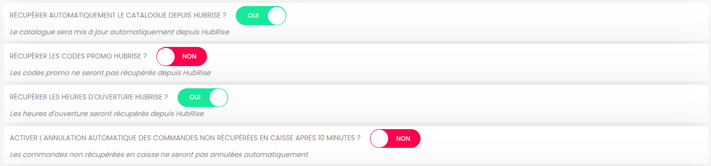
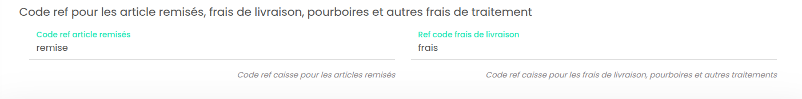
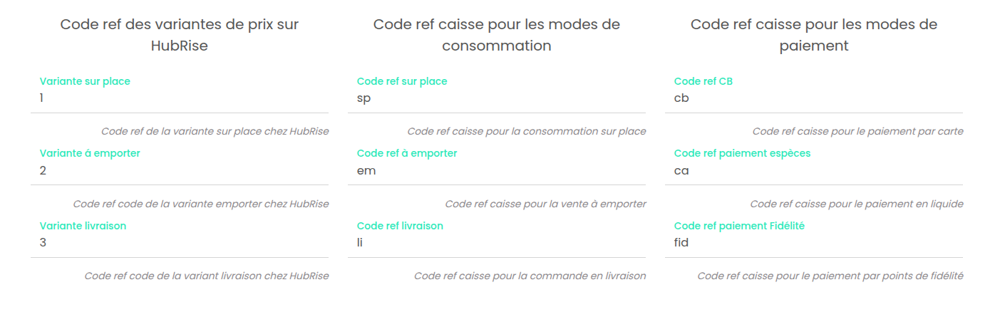

La connexion de Eatself s'effectue en quelques étapes simples et rapides. Il est toutefois nécessaire de réaliser quelques réglages pour que la connexion se comporte exactement comme vous le souhaitez.

Si vous connectez Eatself à un logiciel de caisse via HubRise, vous devrez utiliser des codes ref spécifiques. Ces codes permettent d'identifier de manière unique les produits, les remises, les frais, ou encore les moyens de paiement, afin que toutes les données soient correctement interprétées par votre caisse et les autres applications connectées à HubRise.

Pour accéder à la page de configuration Eatself, procédez comme suit :

1. Depuis le back-office de Eatself, cliquez sur le burger menu pour ouvrir la barre de menu à gauche de l'écran.
1. En bas de page, section **INTÉGRATION CAISSES**, cliquez sur **Compte HubRise**.
1. Sur la page de configuration, effectuez les modifications nécessaires.
1. Cliquez **ENREGISTRER** pour que les modifications soient prises en compte.

## Options d'intégration

La section située en haut de la page de configuration présente plusieurs sélecteurs qui permettent de configurer le comportement de l'intégration.

### Récupération automatique du catalogue

Le catalogue HubRise peut être automatiquement importé dans Eatself à chaque modification dans HubRise.

Pour activer cette fonctionnalité, activez l'options **RÉCUPÉRER AUTOMATIQUEMENT LE CATALOGUE DEPUIS HUBRISE ?** en faisant glisser le bouton vers la droite.

### Codes promo {#promo-codes}

Par défaut, Eatself ne récupère pas les codes promo, mais vous pouvez changer ce paramètre si vous préférez les gérer dans HubRise.

Pour activer cette fonctionnalité, activez l'option **RÉCUPÉRER LES CODES PROMO HUBRISE ?** en faisant glisser le bouton vers la droite.

### Récupérer les heures d'ouverture

Activez l'option **RÉCUPÉRER LES HEURES D'OUVERTURE HUBRISE ?** pour que Eatself récupère automatiquement les heures d'ouverture configurés dans HubRise.

### Annulation automatique des commandes

Par défaut, Eatself n'annule pes les commandes. Vous pouvez cependant activer l'annulation automatique des commandes non transmises à votre logiciel de caisse après un délai de 10 minutes.

Pour activer cette fonctionnalité, activez l'option **ACTIVER L'ANNULATION AUTOMATIQUE DES COMMANDES NON RÉCUPÉRÉES EN CAISSE APRÈS 10 MINUTES ?** en faisant glisser le bouton vers la droite.

## Remises et frais

Ces codes ref sont ajustables dans la section **Code ref pour les article remisés, frais de livraison, pourboires et autres frais de traitement**.

---

**REMARQUE IMPORTANTE :** Pour obtenir les codes ref à utiliser dans cette section et les suivantes, consultez la documentation de votre logiciel de caisse sur le site internet de HubRise.

---

### Remises

La section **Code ref article remisés** permet de spécifier le code ref de la remise appliquée à vos produits, dans le cas où vous en utilisez sur Eatself.

### Frais

Si des frais de livraison s'appliquent, un code ref peut être requis par votre logiciel de caisse. La section **Ref code frais de livraison** permet de spécifier le code ref correspondant.

## Autres codes ref

### Variantes de catalogue

Vous pouvez définir trois types de prix distincts dans un catalogue Eatself, pour la livraison, la vente à emporter, et la consommation sur place.

Si vous utilisez des tarifs différenciés, assurez-vous que les variantes de catalogue nécessaires sont présentes dans HubRise. Pour plus de précisions, voir notre aide en ligne [Variantes de Catalog Manager](/apps/catalog-manager/variants).

La section **Code ref des variantes de prix sur HubRise** dans la page de configuration Eatself vous permet de spécifier le code ref associé à chaque variante de catalogue HubRise. Ces codes sont disponibles dans le back-office de gestion des variantes de **Catalog Manager**.

### Types de service

Les types de service tels que la livraison, vente à emporter et consommation sur place peuvent nécessiter la saisie du code ref correspondant.
Pour configurer ces références, utilisez la section **Code ref caisse pour les modes de consommation**.

### Paiements

Sur Eatself, les clients peuvent régler leur commande en ligne, en espèces ou par le biais de points de fidélité.
La section **Code ref caisse pour les modes de paiement** permet de spécifier les codes ref pour ces trois types de paiement.
