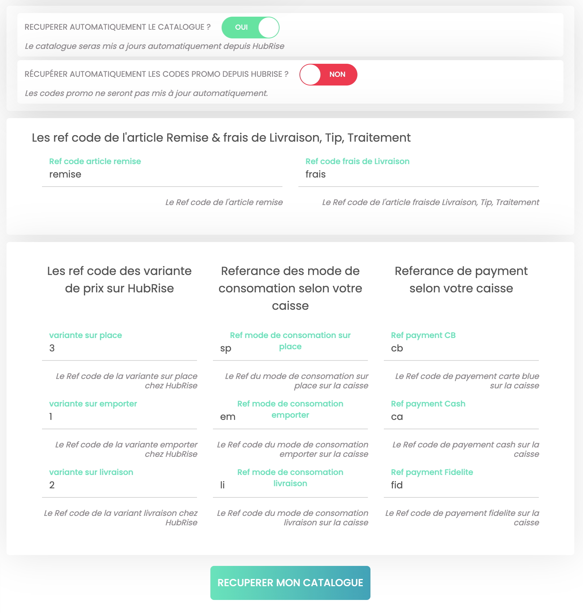

La connexion de Eatself s'effectue en quelques étapes simples et rapides. Il est toutefois nécessaire de réaliser quelques réglages pour que la connexion se comporte exactement comme vous le souhaitez.

Si vous connectez Eatself à un logiciel de caisse via HubRise, vous devrez utiliser des codes ref spécifiques. Ces codes permettent d'identifier de manière unique les produits, les remises, les frais, ou encore les moyens de paiement, afin que toutes les données soient correctement interprétées par votre caisse et les autres applications connectées à HubRise.

Pour accéder à la page de configuration Eatself, procédez comme suit :

1. Depuis le back-office de Eatself, cliquez sur le burger menu pour ouvrir la barre de menu à gauche de l'écran.
1. En bas de page, section **RÉGLAGES PAIEMENT**, cliquez sur **Compte HubRise**.
1. Sur la page de configuration, effectuez les modifications nécessaires.
1. Cliquez **ENREGISTRER** pour que les modifications soient prises en compte.

## Récupération du catalogue

### Récupération automatique

Le catalogue HubRise peut être automatiquement transmis à Eatself.
Pour activer cette fonctionnalité, dans la section **RÉCUPÉRER AUTOMATIQUEMENT LE CATALOGUE ?**, faites glisser le bouton vers la droite pour passer de `NON` à `OUI`.

### Codes promo {#promo-codes}

Par défaut, Eatself ne récupère pas les codes promo, mais vous pouvez changer ce paramètre si vous préférez les gérer dans HubRise. 
Pour activer cette fonctionnalité, dans la section **RÉCUPÉRER AUTOMATIQUEMENT LES CODES PROMO DEPUIS HUBRISE ?**, faites glisser le bouton vers la droite pour passer de `NON` à `OUI`.

### Variantes de catalogue

Vous pouvez définir trois types de prix distincts dans un catalogue Eatself, pour la livraison, la vente à emporter, et la consommation sur place.

Si vous utilisez des tarifs différenciés, assurez-vous que les variantes de catalogue nécessaires sont présentes dans HubRise. Pour plus de précisions, voir notre aide en ligne [Variantes de Catalog Manager](/apps/catalog-manager/variants).

La section **Les ref code des variante de prix sur HubRise** dans la page de configuration Eatself vous permet de spécifier le code ref associé à chaque variante de catalogue HubRise. Ces codes sont disponibles dans le back-office de gestion des variantes de **Catalog Manager**.

## Envoi des commandes

---

**REMARQUE IMPORTANTE :** Pour obtenir les codes ref à utiliser dans les sections suivantes, consultez la documentation de votre logiciel de caisse sur le site internet de HubRise.

---

### Remises

La section **Ref code article remise** permet de spécifier le code ref de la remise appliquée à vos produits, dans le cas où vous en utilisez sur Eatself.

### Frais

Si des frais de livraison s'appliquent, un code ref peut être nécessaire.
La section **Ref code frais de Livraison** permet de spécifier le code ref correspondant.

### Types de service

Les types de service tels que la livraison, vente à emporter et consommation sur place peuvent nécessiter la saisie du code ref correspondant.
Pour configurer ces références, utilisez la section **Référence des mode de consommation selon votre caisse**.

### Paiements

Sur Eatself, les clients peuvent régler leur commande en ligne, en espèces ou par le biais de points de fidélité.
La section **Référence de paiement selon votre caisse** permet de spécifier les codes ref pour ces trois types de paiement.

