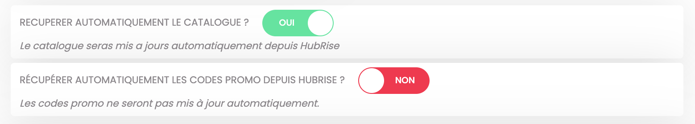

Avec Eatself, vous pouvez récupérer un catalogue HubRise en un clic. Vous pouvez également configurer le bridge de manière à récupérer votre catalogue à chaque fois qu'il est modifié sur HubRise.

Cette page explique comment récupérer le catalogue et quelles informations sont transmises à Eastself.

---

**REMARQUE IMPORTANTE** : Chaque récupération de catalogue provoque une mise à jour de l'inventaire depuis HubRise. Pour plus de précisions sur les inventaires HubRise, voir [Inventaire](#inventory)

---

## Alimenter un catalogue HubRise

Pour mettre à jour votre menu Eatself, vous devez préalablement avoir un catalogue dans HubRise. De nombreuses applications connectées à HubRise, notamment les logiciels de caisse, peuvent envoyer leur catalogue vers HubRise. Pour le vérifier, reportez-vous à la documentation de votre logiciel de caisse sur le site internet de HubRise.

Vous pouvez aussi alimenter un catalogue HubRise en récupérant un menu existant depuis Deliveroo ou Uber Eats. Pour plus d'informations, consultez ces liens :

- [Récupérer un catalogue depuis Deliveroo](/apps/deliveroo/pull-catalog)
- [Récupérer un catalogue depuis Uber Eats](/apps/uber-eats/pull-catalog)

## Récupération manuelle du catalogue

Une fois que vous avez alimenté votre catalogue sur HubRise et assigné des codes ref à tous les produits et options, vous pouvez le récupérer dans Eatself en suivant ces étapes :

1. Depuis le back-office d'Eatself, cliquez sur le burger menu pour ouvrir la barre de menu à gauche de l'écran.
1. Section **RÉGLAGES PAIEMENT** cliquer sur **Compte HubRise**.
1. Section **Vous êtes actuellement connecté au compte** assurez-vous d'être connecté au bon catalogue HubRise.
1. Cliquez sur le bouton **RÉCUPÉRER MON CATALOGUE** en bas de page.
1. Une popup indiquant Le catalogue a été importé avec succès s'affiche.
1. Vérifiez que votre menu en ligne est mis à jour sur votre site Eatself.

---

**REMARQUE IMPORTANTE :** La récupération de votre catalogue HubRise effacera votre menu actuel dans Eatself. Cette action est irréversible.

---

## Récupération automatique du catalogue

Eatself peut récupérer automatiquement votre catalogue HubRise à chaque fois qu'il est modifié dans HubRise. Cela signifie que vous n'avez pas besoin de vous connecter manuellement à Eatself pour mettre à jour votre menu. Par défaut, cette option est activée. Vous pouvez la désactiver en suivant ces étapes :

1. Depuis le back-office d'Eatself, cliquez sur le burger menu pour ouvrir la barre de menu à gauche de l'écran.
1. Section **RÉGLAGES PAIEMENT** cliquez sur **Compte HubRise**.
1. Option **RECUPERER AUTOMATIQUEMENT LE CATALOGUE ?** faites glisser le bouton `OUI` vers la gauche pour le désactiver.

## Informations récupérées par Eatself

### Inventaire {#inventory}

L'envoi du catalogue HubRise vers Eatself entraîne la récupération de l'inventaire depuis HubRise. Il est donc essentiel de vérifier que votre inventaire est correct dans HubRise avant un envoi de catalogue vers Eatself.

### Remises

Par défaut, Eatself ne récupère pas les remises du catalogue HubRise, afin de ne pas écraser vos codes promo Eatself. 

Vous pouvez activer la synchronisation des remises dans la page de configuration du back-office de Eatself. Pour plus d'informations, voir [Codes promo(/apps/eatself/configuration#promo-codes)

### Frais

Eatself ne récupère pas les frais du catalogue HubRise.

### Images

Lors de la récupération d'un catalogue HubRise, Eatself utilise les images des produits et des options HubRise. Si une image est manquante dans HubRise, Eatself utilise l'image précédemment définie pour le produit ou l'option, si elle existe.
