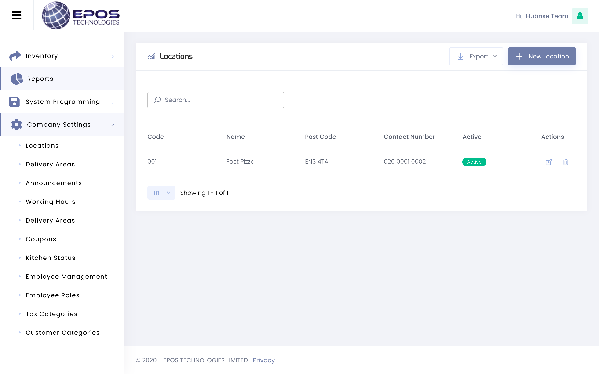
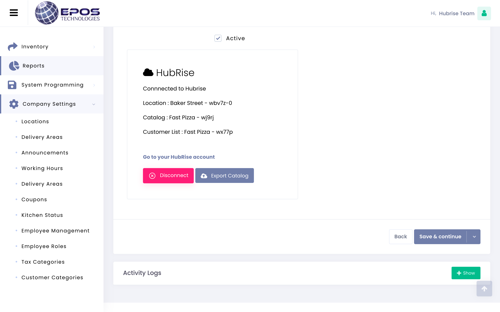

---

**IMPORTANT NOTE:** If you don't already have a HubRise account, start by registering on the [HubRise Signup Page](https://manager.hubrise.com/signup). It only takes a minute!

---

You can connect EPOS Technologies to HubRise autonomously from your EPOS Technologies back office.

To activate the connection between EPOS Technologies and HubRise, follow these steps.

1. Log in to your EPOS Technologies back office.
1. From the navigation menu, select **Company Settings** > **Locations**.
1. From the **Locations** page, click the <InlineImage width="20" height="20"></InlineImage> **Edit** icon next to the location you want to connect.
   
1. From the **Edit** page, navigate to the bottom to find the **HubRise** card, then click **Connect**.
1. From the HubRise authorisation page, select the location you want to connect and click **Allow** to give EPOS Technologies access to your data.
1. When prompted, enter your EPOS Technologies credentials to confirm the operation.

Once connected to HubRise, the location details will appear in your EPOS Technologies back office.

If you want to connect multiple restaurants, each location should be connected to HubRise independently following the steps outlined above.
