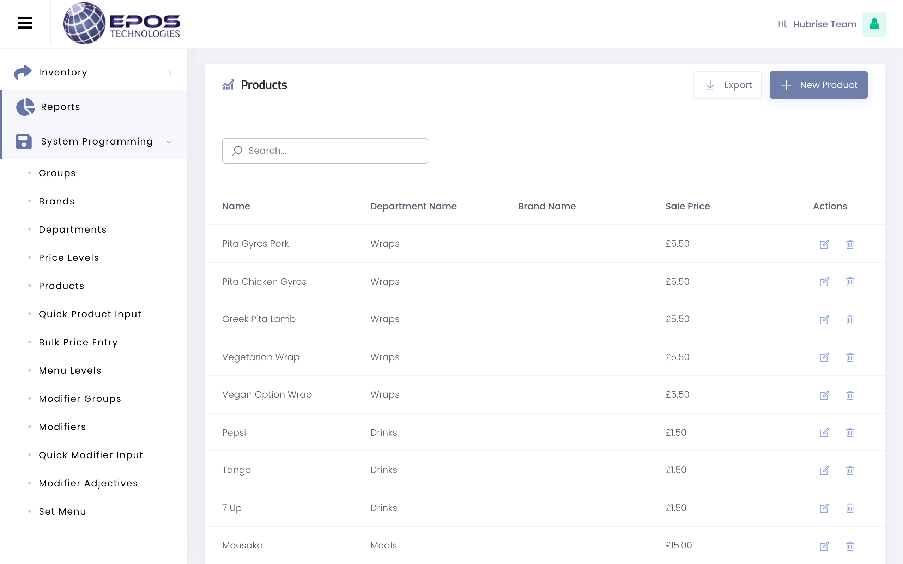
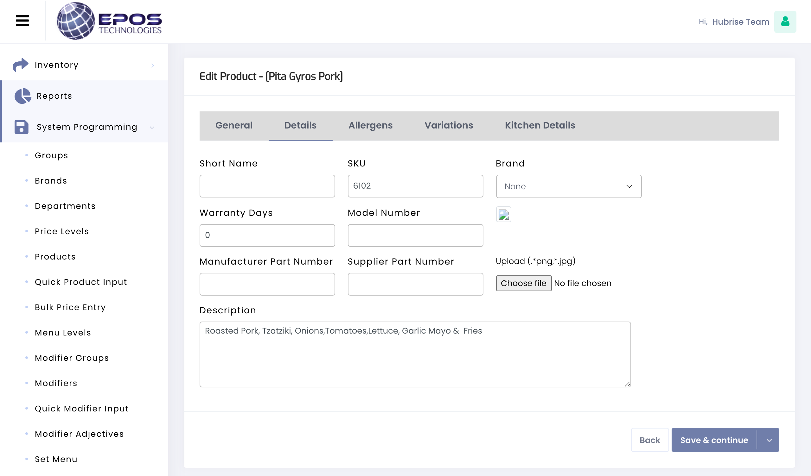

When you create a product or option, you need to assign a ref code so that EPOS Technologies can correctly receive orders from your connected solutions.

For existing items, you can check individual ref codes or review the ref codes for the entire catalog in bulk from the **Products** page in your back office.

## Checking Individual Ref Codes

If you need to find the ref code associated to a specific product, follow these steps.

1. From the navigation menu, go to **System Programming** > **Products**.
2. From the list of products, click the <InlineImage width="20" height="20"></InlineImage> **Edit** icon next to the product of interest.
3. Go to the **Details** tab. The ref code, if present, appears in the **SKU** field.

---

**IMPORTANT NOTE**: You cannot find ref codes for options from the EPOS Technologies back office, but you can do so by exporting your catalog as described below.

---

## Exporting The Catalog In Bulk

If you want to check the ref codes for all products and options in your catalog, follow these steps.

1. From the navigation menu, go to **System Programming** > **Products**.
1. Click the **Export** button at the top of the page to download an XLSX table with your catalog.
1. Open the file with Microsoft Excel or another spreadsheet tool. The ref codes appear under the **SKU** column.