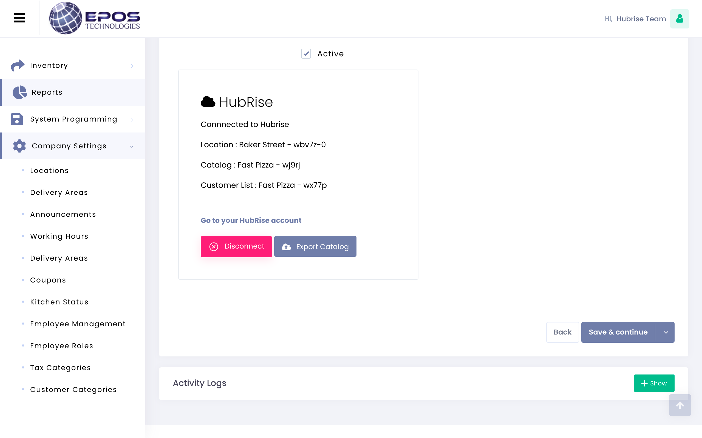

This page describes how to export your EPOS Technologies catalog and what information is sent to HubRise.

## Exporting The Catalog To HubRise

To export your EPOS Technologies catalog to HubRise, follow these steps.

1. Log in to your EPOS Technologies back office.
1. From the navigation menu, select **Company Settings** > **Locations**.
1. From the **Locations** page, click the <InlineImage width="20" height="20"></InlineImage> **Edit** icon next to the location you want to connect.
   
   
2. From the **Edit Location** page, navigate to the bottom to find the **HubRise** card, then click **Export Catalog**.
   
3. Click **Yes** to confirm the operation.

---

**IMPORTANT NOTE**: This operation will replace your current HubRise catalog.

---

Depending on how large your catalog is, it might take a few minutes for your HubRise catalog to be fully updated.

## Technical Reference

The following sections provide more details on how your EPOS Technologies catalog is mapped to HubRise.

### Categories

The categories in the EPOS Technologies catalog are mapped one-to-one to categories of products on HubRise. 
Categories sent to HubRise are ordered by ascending value of ref code.

For every category, the following fields are sent to HubRise.

- `name`: The name of the category.
- `ref`: The ref code of the category.
- `description`: The description of the category.
- `image_ids`: The IDs of the images associated with the category.

### Products and Skus

EPOS Technologies supports products and skus, and this product structure is mapped one-to-one to HubRise.

For every product, EPOS Technologies sends the following information to HubRise.

- `name`: The name of the product.             
- `ref`: The ref code of the product, which will be passed along in orders.  
- `description`: The description of the product.
- `skus`: The list of skus associated with the product.
- `image_ids`: The list of image IDs associated with the product.

For every sku in the list, EPOS Technologies sends the following information to HubRise.

- `name`: The name of the sku.             
- `ref`: The ref code of the sku, which will be passed along in orders.  
- `price`: The price of the sku.            
- `option_list_refs`: The list of options attached to the sku.
- `price_overrides`: The list of conditional price changes for the sku.

### Options

EPOS Technologies supports option lists and options, and this information is mapped one-to-one to HubRise.

For every option list, EPOS Technologies sends the following information to HubRise.

- `name`: The name of the option list.             
- `ref`: The ref code of the option list.  
- `description`: The type of option list.
- `options`: The list of options associated with the option list.

For every option in the list, EPOS Technologies sends the following information to HubRise.

- `name`: The name of the option.             
- `ref`: The ref code of the option, which will be passed along in orders.  
- `price`: The price of the option.            

### Deals

EPOS Technologies supports two types of deals:

- **Set Menu**: A bundle of products at a fixed price.
- **Mix And Match**: A combination of two products where the second has a discounted price.

The deals your create in EPOS Technologies are mapped one-to-one to HubRise.

For each deal, the following information is sent to HubRise.

- `name`: The name of the deal.
- `ref`: The ref code of the deal.
- `lines`: The array of product lines included in the deals.

For each product line, the following information is sent to HubRise.

- `label`
- `pricing_effect`
- `pricing_value`
- `skus`

For more information about deals in HubRise, see the [API page for deals](/developers/api/catalog-management#deal-in-catalog-upload).

### Charges

EPOS Technologies supports multiple delivery charges depending on delivery distance and service charges.
These are sent to HubRise when you export the catalog.

For every charge, the following information is sent to HubRise.

- `type`: The type of charge.
- `name`: The name of the option.             
- `price`: The price of the option.            
- `ref`: Available only for delivery charges. The hardcoded value is `RES_DEL` for all delivery charges.  

### Discounts

EPOS Technologies supports discounts and sends this information to HubRise when you export the catalog.

For every discount, the following information is sent to HubRise.

- `name`
- `ref`
- `pricing_value`
- `pricing_effect`
- `restrictions`

For more information about discounts in HubRise, see the [API page for discounts](/developers/api/catalog-management#discounts).