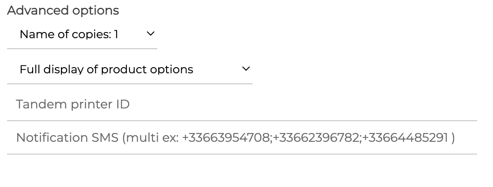
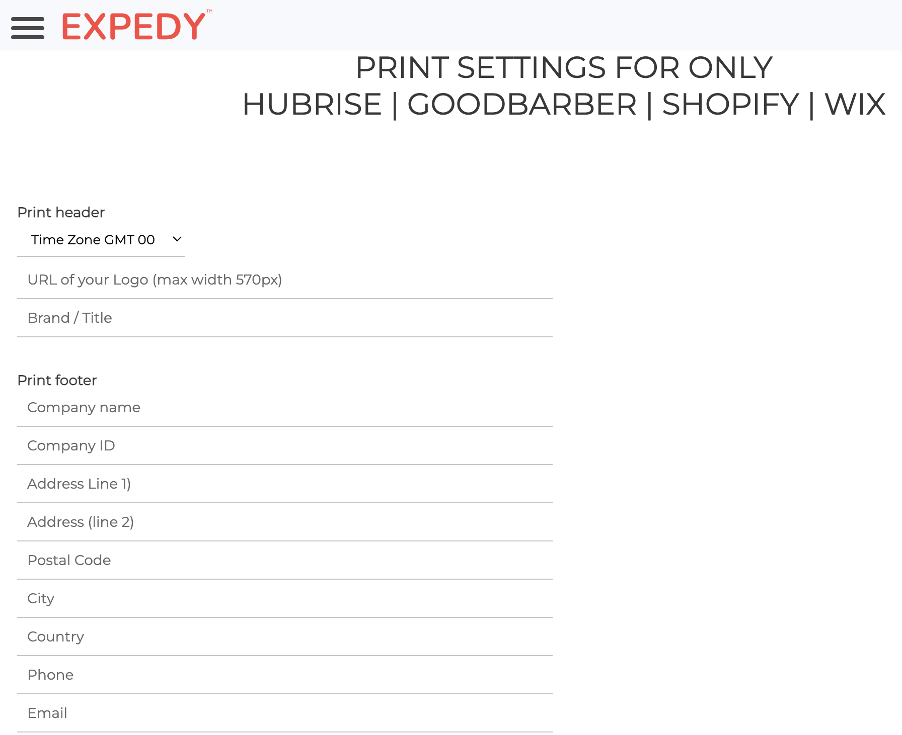
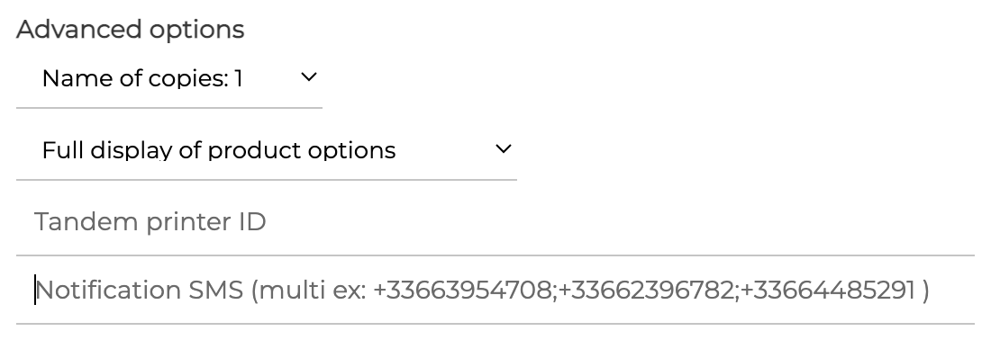

From the Expedy back office, you can configure the printer behaviour and the print layout.

## HubRise Settings

With Expedy, you can select the order status that triggers printing. You can choose to print the orders when they reach one of these 3 statuses on HubRise:

- _New_
- _Received_
- _Accepted_

Expedy also allows another action when receiving an order. You can configure the printer to change the status of an order into:

- _Received_
- _Accepted_

To configure these settings, follow these steps:

1. From Expedy back office homepage, click **Printers**.
2. Click the configuration icon next to the connected printer <InlineImage width="20" height="20"></InlineImage>.
3. Scroll down to the **HubRise** section.
4. In section **A la réception d'une commande** (When receiving an order), choose when to print. You can also configure an action in section **Effectuer une des actions supplémentaires suivantes ?** (Perform one of the following extra actions?)
   
5. Click **SAVE** to save the changes.

## Customise Receipts {#customise-receipts}

You can display the name and logo of your company in the header of receipts, and the full address of your store in the footer.

To configure the layout of receipts, follow these steps:

1. From Expedy back office homepage, click **Printers**.
2. Click the configuration icon next to the connected printer <InlineImage width="20" height="20"></InlineImage>.
3. Scroll down to section **PRINT SETTINGS FOR ONLY HUBRISE | GOODBARBER | SHOPIFY | WIX**.
   
4. Adjust print settings accordingly.
5. Click **SAVE** to save the changes.

To know which data is printed by default on receipts, see [Receive Orders](/apps/expedy/receive-orders).

## Advanced Settings

You can set the number of copies and the optional use of an additional printer. You can also configure an SMS notification to be sent with each print, subject to an additional fee. Please inquire with Expedy.

To configure the options, follow these steps:

1. From Expedy back office homepage, click **Printers**.
2. Click the configuration icon next to the connected printer <InlineImage width="20" height="20"></InlineImage>.
3. Scroll down to section **PRINT SETTINGS FOR ONLY HUBRISE | GOODBARBER | SHOPIFY | WIX**.
4. In the **Advanced Options** section, choose the number of copies and whether to display the options in full or not.
   
