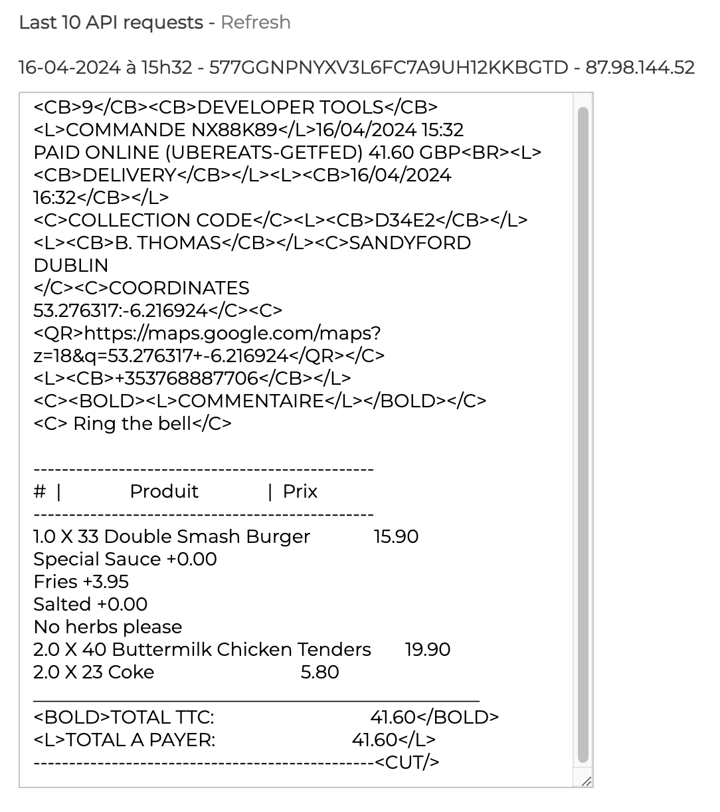
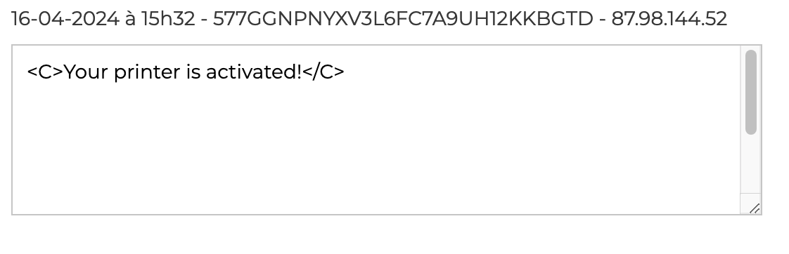

From Expedy back office, you can view your prints and configure printing parameters.

To access Expedy back office, follow these steps:

1. From Expedy back office homepage, click **Printers**.
2. Click the configuration icon next to the connected printer <InlineImage width="20" height="20"></InlineImage>.

## Status of Last Prints

When your printer is turned on, HubRise orders are printed as soon as they are received or, depending on your configuration, as soon as they reach a status that triggers printing.

When your printer is turned off, orders are queued until the printer is back on.

With Expedy, you can view the print volume over 30 days.

## Last Prints

With Expedy, you can view the last 10 orders received. Scroll down to the **Last 10 API requests** section.

## Powered On Printer

In the section below the Last 10 API requests section, you can check if the printer is powered on.

## Print Settings

To set up your print settings, see [Configuration](/apps/expedy/configuration).
