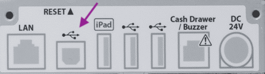

You probably already have one or more printers. The Expedy Cloud Print Box module allows you to connect your printer to HubRise and benefit from features similar to those of integrated Expedy printers.

For this module to work, your printer must have two features:

1. Your printer should be an ESC/POS printer (Epson, Star, Brother, Toshiba, Zebra, etc.).
2. Your printer must have a USB Type B port.
   

More information is available on the Expedy Print website:

- For merchants: [Expedy Cloud Print Box ESC POS](https://www.printer-point.com/shop/cloud-print-box/expedy-cloud-print-box-esc-pos)
- For restaurants: [Expedy Cloud Print Box Restaurant](https://www.printer-point.com/shop/cloud-print-box/expedy-cloud-print-box-restaurant)

You can also contact Expedy Print by email: commercial@expedy.fr.
