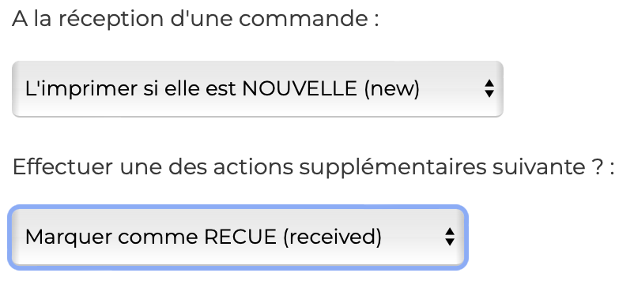
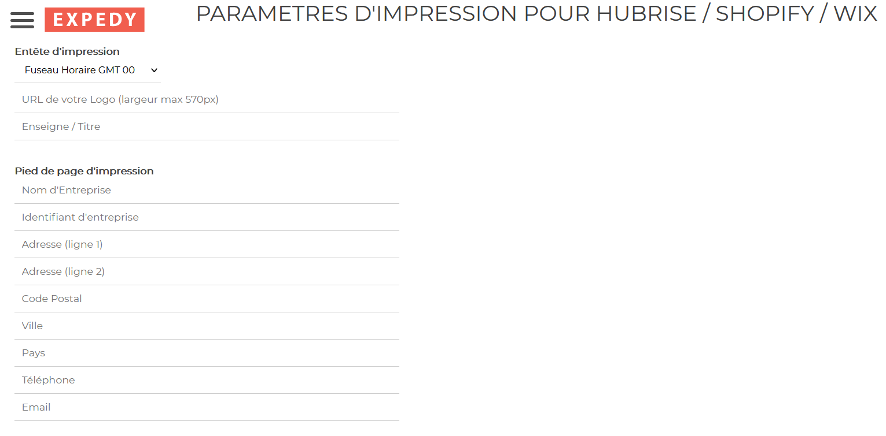
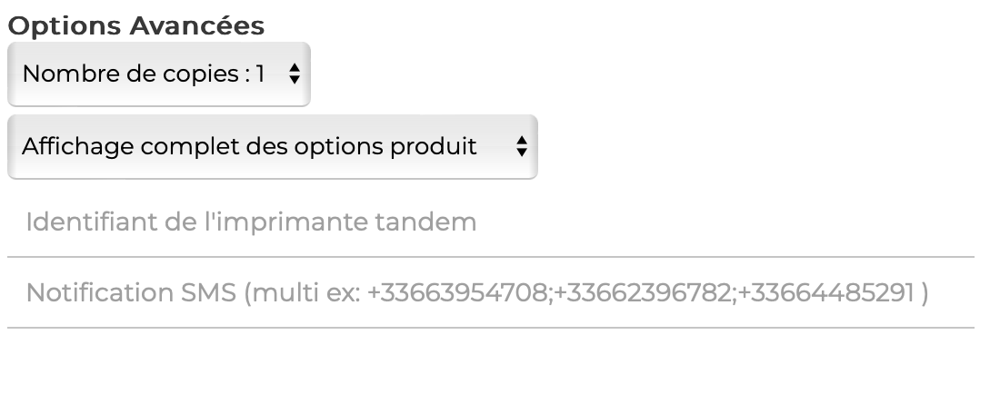

Le back-office de Expedy permet de configurer le comportement de l'imprimante et la mise en page de vos impressions.

## Paramètres HubRise

Expedy permet de sélectionner le statut de commande qui déclenche l'impression. Vous pouvez ainsi choisir d'imprimer les commandes lorsqu'elles passent dans l'un des 3 statuts suivants sur HubRise :

- **new** (nouvelle)
- **received** (reçue)
- **accepted** (acceptée).

Expedy permet aussi d'effectuer une action supplémentaire lors de la réception d'une commande. Vous pouvez ainsi configurer l'imprimante pour qu'elle change le statut d'une commande en :

- **none** (non) : aucun changement de statut ne sera effectué.
- **received** (reçue) : le statut de la commande sera mis à jour en reçue.
- **accepted** (acceptée) : le statut de la commande sera mis à jour en acceptée.

Pour configurer ces paramètres, suivez ces étapes :

1. Depuis la page d'accueil du back-office Expedy, cliquez sur **Printers** (Imprimantes).
1. Cliquez sur l'icône de configuration de l'imprimante à connecter <InlineImage width="25" height="25"></InlineImage>.
1. Section **CONNECTIONS & PLUGINS** défilez vers le bas jusqu'à **HubRise**.
1. Section **A la récéption d'une commande** choisir quand imprimer. Vous pouvez également mettre en place une action section **Effectuer une des actions supplémentaires suivantes ?**
   
1. Cliquez sur **SAUVEGARDER** pour enregistrer les modifications.

## Personnalisation des tickets {#customise-receipts}

Vous pouvez configurer le nom et le logo de votre société en tête des tickets. Vous pouvez également afficher l'adresse complète de votre établissement en pied de page.

Pour configurer la mise en page des tickets, suivez ces étapes :

1. Depuis la page d'accueil du back-office Expedy, cliquez sur **Printers** (Imprimantes).
1. Cliquez sur l'icône de configuration de l'imprimante à connecter <InlineImage width="25" height="25"></InlineImage>.
1. Section **CONNECTIONS & PLUGINS** défilez vers le bas jusqu'à **HubRise**.
   
1. Ajustez les paramètres d'impression selon vos besoins.
1. Cliquez sur **SAUVEGARDER** pour enregistrer les modifications.

Pour connaître les informations imprimées par défaut sur les tickets, consultez la section [Recevoir les commandes](/apps/expedy/receive-orders).

## Paramètres avancés

Vous pouvez paramétrer le nombre de copies et l'utilisation optionnelle d'une imprimante supplémentaire. Vous pouvez également configurer l'envoi d'une notification SMS à chaque impression, moyennant un forfait supplémentaire. Se renseigner auprès d'Expedy.

Pour paramétrer ces options, suivez ces étapes :

1. Depuis la page d'accueil du back-office Expedy, cliquez sur **Printers** (Imprimantes).
1. Cliquez sur l'icône de configuration de l'imprimante à connecter <InlineImage width="25" height="25"></InlineImage>.
1. Section **CONNECTIONS & PLUGINS** défilez vers le bas jusqu'à **HubRise**.
1. Section **Options Avancées** choisir le nombre de copies d'impressions et un affichage complet ou non des options.
   
