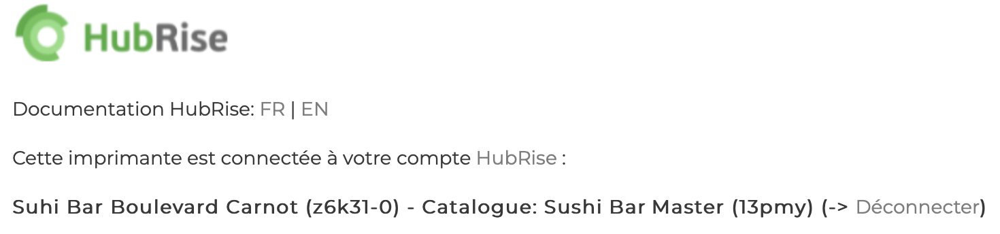

---

**REMARQUE IMPORTANTE :** Si vous ne possédez pas encore de compte HubRise, commencez par en ouvrir un sur la [page d'inscription à HubRise](https://manager.hubrise.com/signup). L'inscription ne prend que quelques minutes !

---

## Connecter Expedy

Pour connecter votre imprimante Expedy à HubRise, suivez ces étapes :

1. Depuis la page d'accueil du back-office Expedy, cliquez sur **Imprimantes**.
1. Cliquez sur **Edit** si vous souhaitez renommer votre imprimante pour plus de clarté.
   
1. Cliquez sur l'icône de configuration de l'imprimante à connecter <InlineImage width="20" height="20"></InlineImage>.
1. Défilez vers le bas jusqu'à la section **HubRise**.
   
1. Cliquez sur **Cliquez pour connecter cette imprimante à un de vos comptes HubRise**. 
1. Vous êtes redirigé vers l'interface HubRise.
1. Si vous avez plusieurs points de vente, choisissez le point de vente à connecter. Si le point de vente sélectionné possède plusieurs listes de clients ou catalogues, cliquez sur **Suivant** pour afficher les listes déroulantes correspondantes, puis sélectionnez les options voulues.
1. Cliquez sur **Autoriser**. La connexion est active.

## Vérifier la connexion
1. Depuis la page d'accueil du back-office Expedy, cliquez sur **Imprimantes**.
1. Cliquez sur l'icône de configuration de l'imprimante connectée <InlineImage width="20" height="20"></InlineImage>.
1. Défilez vers le bas jusqu'à la section **HubRise**.
1. La mention **Cette imprimante est connectée à votre compte HubRise** indique le succès de l'opération. 
1. Vérifiez également le nom du compte HubRise et du catalogue que vous avez connecté.
   

## Donner accès au support de Expedy {#give-access}

Pour faciliter la prise en charge de vos demandes de support, nous vous recommandons de donner accès à votre compte HubRise à l'éditeur de la solution Expedy.

Pour donner accès à Expedy, procédez comme suit :

1. Depuis le back-office de HubRise, sélectionnez **CONFIGURATION** dans le menu de gauche.
1. Dans la section **Permissions**, ajoutez support@expedy.fr en sélectionnant l'option **Manager** dans la liste déroulante des rôles.
1. Cliquez sur l'icône **+** pour ajouter le nouvel utilisateur.

L'ajout d'un utilisateur est le moyen recommandé de donner accès à un tiers à votre point de vente. Le partage de mot de passe est déconseillé pour des raisons de sécurité.

## Déconnecter Expedy

1. Depuis la page d'accueil du back-office Expedy, cliquez sur **Imprimantes**.
1. Cliquez sur l'icône de configuration de l'imprimante à connecter. <InlineImage width="20" height="20"></InlineImage>.
1. Défilez vers le bas jusqu'à la section **HubRise**.
1. Cliquez sur **Déconnecter**.
