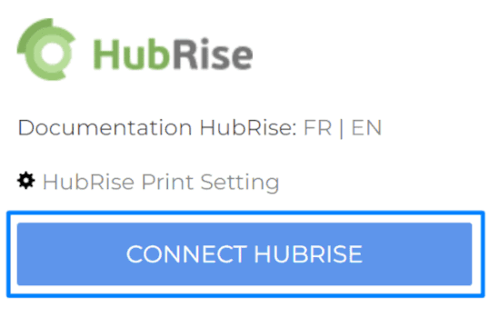

---

**REMARQUE IMPORTANTE :** Si vous ne possédez pas encore de compte HubRise, commencez par en ouvrir un sur la [page d'inscription à HubRise](https://manager.hubrise.com/signup). L'inscription ne prend que quelques minutes !

---

## Connecter Expedy

Pour connecter votre imprimante Expedy à HubRise, suivez ces étapes :

1. Depuis la page d'accueil du back-office Expedy, cliquez sur **Printers** (Imprimantes).
1. Si vous souhaitez renommer votre imprimante, cliquez sur l'icône stylo à droite de **My SHOP**.
   
1. Cliquez sur l'icône de configuration de l'imprimante à connecter <InlineImage width="25" height="25"></InlineImage>.
1. Section **CONNECTIONS & PLUGINS** défilez vers le bas jusqu'à **HubRise**.
1. Cliquez sur **CONNECT HUBRISE**.
   
1. Vous êtes redirigé vers l'interface HubRise.
1. Si vous avez plusieurs points de vente, choisissez le point de vente à connecter. Si le point de vente sélectionné possède plusieurs listes de clients ou catalogues, cliquez sur **Suivant** pour afficher les listes déroulantes correspondantes, puis sélectionnez les options voulues.
1. Cliquez sur **Autoriser**. La connexion est active.
1. Vous êtes redirigé vers la page d’accueil de la console Expedy, qui est disponible uniquement en anglais, et le message suivant s’affiche.
   

---

**REMARQUE IMPORTANTE :** Une imprimante Expedy ne peut être connectée qu’à un seul point de vente HubRise. Elle ne peut pas être partagée entre plusieurs points de vente.

---

## Vérifier la connexion

1. Depuis la page d'accueil du back-office Expedy, cliquez sur **Printers** (Imprimantes).
1. Cliquez sur l'icône de configuration de l'imprimante à connecter <InlineImage width="25" height="25"></InlineImage>.
1. Section **CONNECTIONS & PLUGINS** défilez vers le bas jusqu'à **HubRise**.
1. La mention **This printer is connected to your account HubRise** (Cette imprimante est connectée à votre compte HubRise) indique que la connexion est bien établie.
1. Vérifiez également le nom du point de vente et du catalogue que vous avez connectés.
   

## Donner accès au support de Expedy {#give-access}

Pour faciliter la prise en charge de vos demandes de support, nous vous recommandons de donner accès à votre compte HubRise à l'éditeur de la solution Expedy.

Pour donner accès à Expedy, procédez comme suit :

1. Depuis le back-office de HubRise, sélectionnez **CONFIGURATION** dans le menu de gauche.
1. Dans la section **Permissions**, ajoutez `support@expedy.fr`.
1. Cliquez sur **Ajouter l'utilisateur**.
1. Dans le menu déroulant de choix d'un rôle prédéfini, sélectionnez **Partenaire Technique**.
1. Cliquez sur **Définir les permissions**.

L'ajout d'un utilisateur est le moyen recommandé de donner accès à un tiers à votre point de vente. Le partage de mot de passe est déconseillé pour des raisons de sécurité.

## Déconnecter Expedy

1. Depuis la page d'accueil du back-office Expedy, cliquez sur **Printers** (Imprimantes).
1. Cliquez sur l'icône de configuration de l'imprimante à connecter <InlineImage width="25" height="25"></InlineImage>.
1. Section **CONNECTIONS & PLUGINS** défilez vers le bas jusqu'à **HubRise**.
1. Cliquez sur **Disconnect** (Déconnecter).
   
