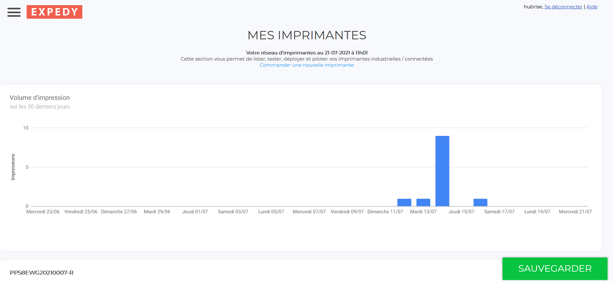
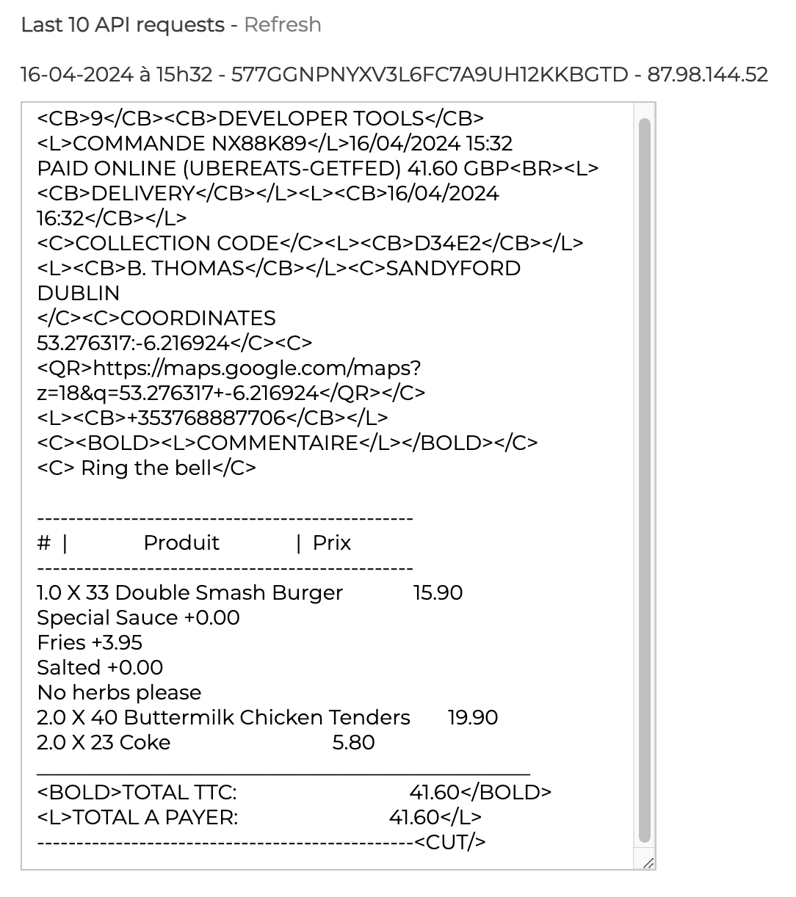
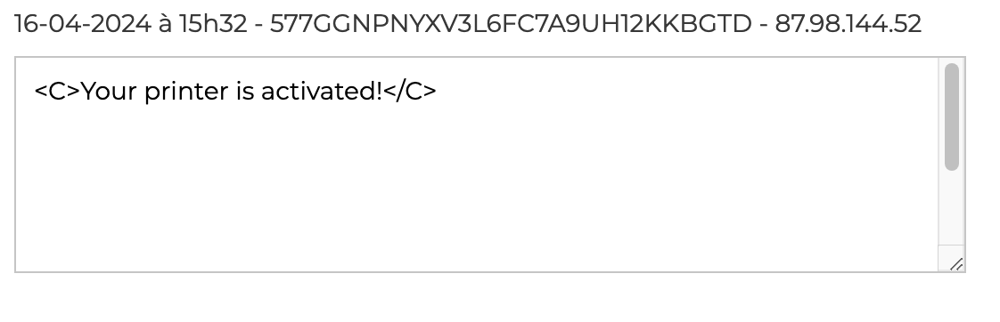

Le back-office de Expedy permet de visualiser vos impressions et de configurer les paramètres d'impression.

Pour accèder au back-office Expedy, suivre ces étapes :
1. Depuis la page d'accueil du back-office Expedy, cliquez sur **Imprimantes**.
1. Cliquez sur l'icône de configuration de l'imprimante connectée <InlineImage width="20" height="20"></InlineImage>.

## Statut des dernières impressions

Lorsque votre imprimante est sous tension, les commandes HubRise sont imprimées dès réception, ou selon votre configuration, dès qu'elles passent dans un statut qui déclenche l'impression. Pour plus d'informations sur les status, voir la rubrique [Configuration](/apps/expedy/configuration).

Si votre imprimante est hors tension, les commandes sont mises en attente jusqu'à la prochaine mise sous tension.

Expedy permet de visualiser le volume d'impression en 30 jours.

## Dernières impressions

Expedy permet de visualiser les détails des 10 dernières commandes reçues. Pour les consulter, défilez vers le bas jusqu'à la section intitulée **10 dernières requêtes API**.

## Imprimante sous tension
Vous pouvez vérifier que l'imprimante est bien sous tension dans l'encart situé en dessous de celui qui représente les dernières requêtes API.

## Paramètres d'impressions

Pour configurer vos paramètres d'impressions, voir la rubrique [Configuration](/apps/expedy/configuration).

