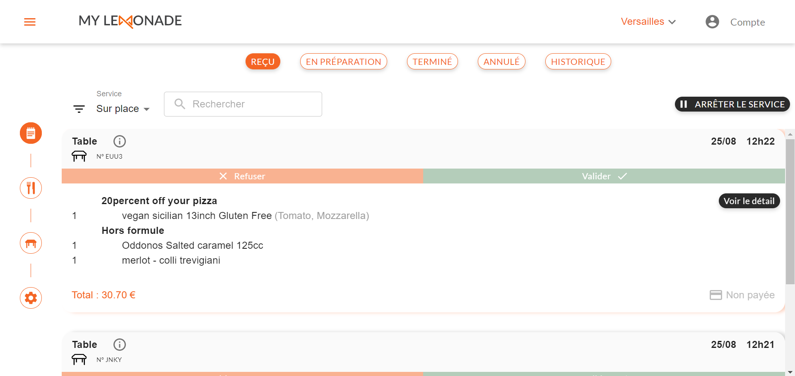
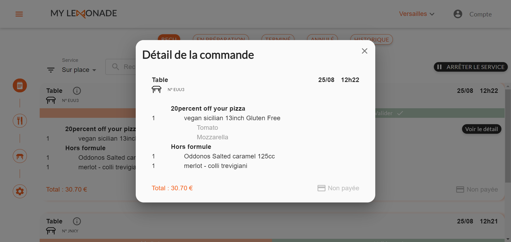

Dès que Get Resto est connecté à HubRise, les commandes enregistrées sur Get Resto sont envoyées automatiquement vers HubRise.

## Liste des commandes

Pour voir la liste des commandes sur Get Resto :

1.  Dans le menu latéral du back office, sélectionnez **Commandes**.
1.  Sélectionnez l'onglet correspondant au statut de la commande désirée : **Reçu**, **En préparation**, **Terminé** ou **Annulé**.
    

## Détails d'une commande

Pour voir les détails d'une commande :

1.  Dans le menu latéral du back office, sélectionnez **Commandes**.
1.  Sélectionnez l'onglet correspondant au statut de la commande désirée.
1.  Cliquez sur **Voir le détail**.
    

## Synchronisation des statuts de commande

Les statuts de commande sont synchronisés dans les deux sens entre Get Resto et HubRise :

- Si vous modifiez le statut d'une commande dans Get Resto, le nouveau statut est envoyé à HubRise.
- Si le statut d'une commande est modifié par une solution tierce, par exemple le logiciel de caisse, le nouveau statut apparaît automatiquement dans Get Resto.

Pour modifier le statut d'une commande dans Get Resto, cliquez sur le bouton correspondant dans le détail de la commande.

Les statuts de commande de Get Resto sont identiques aux statuts de HubRise :

- _new_ : la commande a été créée.
- _received_ : la commande a été reçue.
- _in_preparation_ : la commande est en cours de préparation.
- _awaiting_shipment_ : la commande est en attente de transport.
- _awaiting_collection_ : la commande est en attente de récupération.
- _in_delivery_ : la commande est en cours de livraison.
- _completed_ : la commande est terminée.
- _rejected_ : la commande a été rejetée.
- _cancelled_ : la commande a été annulée.
- _delivery_failed_ : la commande n'a pas pu être livrée.
