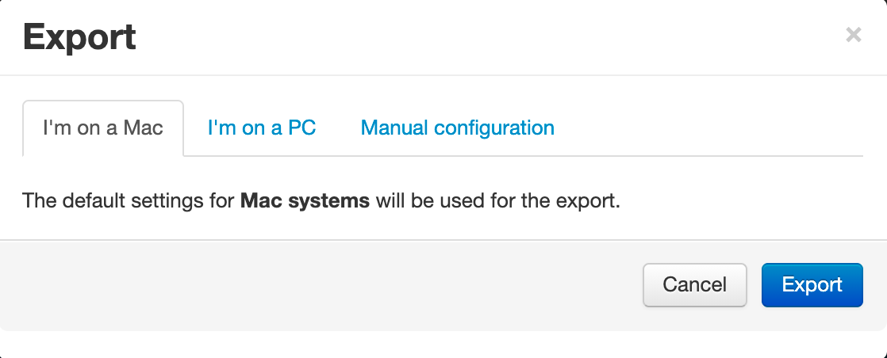
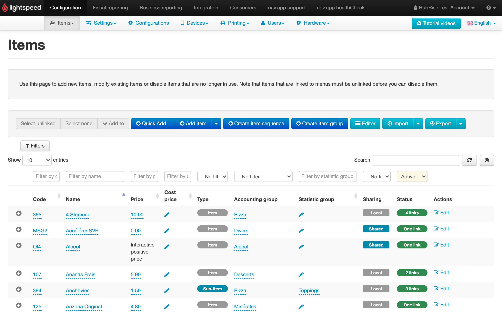

---

**IMPORTANT NOTE:** Lightspeed Restaurant (K Series) was formerly known as iKentoo. iKentoo Bridge will soon be renamed Lightspeed Bridge to align with the new name.

---

Lightspeed expects all incoming orders to contain specific ref codes for each sku, option, deal, discount, charge, service type, and payment present. You must ensure that all connected apps use the correct ref codes if you want your orders to be correctly processed.

This page explains how to find the ref codes by either downloading your Lightspeed catalog in bulk, or by checking individual items in the back office.

You can also export your Lightspeed catalog directly into HubRise with iKentoo Bridge.
Some connected apps offer the ability to import the catalog directly from HubRise, and therefore to autopopulate the ref codes.
For more details about this feature and its limitations in iKentoo Bridge, see [Pushing the Catalog](/apps/ikentoo-lightspeed/pushing-catalog).

## Downloading The Catalog In Bulk

You can download your Lightspeed catalog to manage the items and the ref codes with a separate software.

To download the Lightspeed catalog, follow these steps.

1. From your Lightspeed back office, select **Configuration**, then select **Items** > **Items**.
1. Click the **Export** button.
1. 
1. In the popup window, choose your operating system type: Mac or Windows (or Manual configuration), then click **Export**.
   
1. After the export is complete, select **Click here to download the exported file** to download the CSV file with your menu.
   

To check the ref codes for the items, you can open the downloaded CSV file in Excel or a text editor. The ref codes appear under the **SKU** column.

## Finding Ref Codes For Individual Items

You can find the ref codes for skus, options, deals, discounts, charges, service types, and payments from your Lightspeed back office.

### Skus, Options, And Charges

To find the ref codes for specific skus and options, follow these steps.

1. From the top menu in your Lightspeed back office, select **Configuration**, then **Items** > **Items**.
1. The ref codes for skus and options appear under the **Code** column.
   

You can then copy the codes in the connected app. For detailed instructions, follow the documentation for the connected app in the HubRise website.

If you created charges as skus, as described in [Create Ref Codes](/apps/ikentoo-lightspeed/create-ref-codes#charges), you will find their ref codes in the same way as above.

### Service Types

Service types are called _account profiles_ on Lightspeed. To find the ref code for a specific service type, follow these steps.

1. From your Lightspeed back office, select **Configuration**, then select **Settings** > **Account profiles**.
1. For each service type available under the **Name** column, you can find the corresponding ref code under the **Code** column.

### Discounts

To find the ref code for a specific discount, follow these steps.

1. From your Lightspeed back office, select **Configuration**, then select **Settings** > **Discounts**.
1. For each discount, you can find the corresponding ref code under the **Code** column.

### Payment Methods

To find the ref code for a payment method, follow these steps.

1. From your Lightspeed back office, select **Configuration**, then select **Settings** > **Payment methods**.
1. For each payment method available under the **Name** column, you can find the corresponding ref code under the **Code** column.
